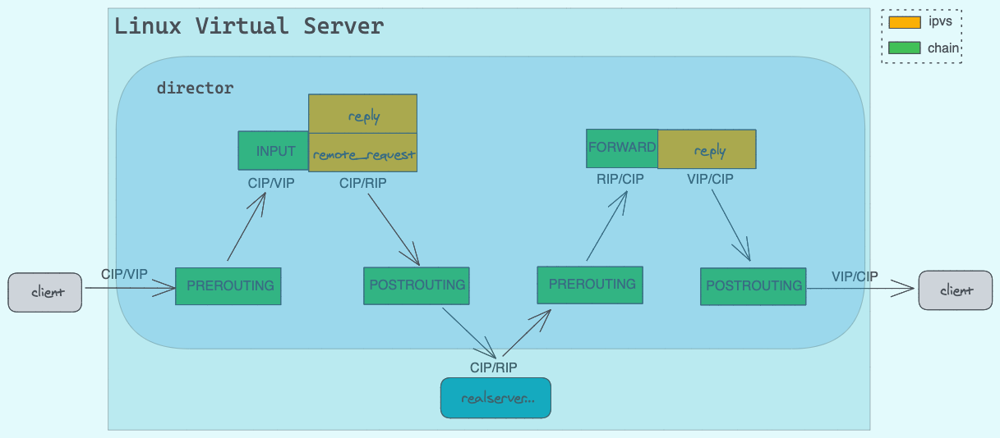
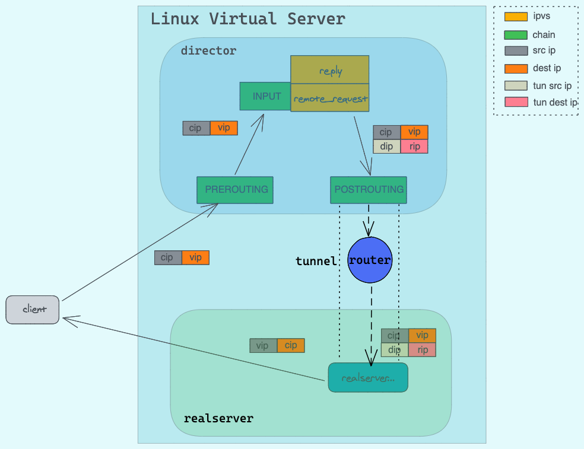

# 深入理解LVS


## 1. 介绍

接上一篇[深入理解iptables](../deep_iptables)，kubernetes service技术还用到ipvs技术，讲到ipvs，那就得说说LVS了，这篇我们来了解下LVS具体的实现机制。

***

## 2. IPVS

> IPVS（IP虚拟服务器）实现传输层负载均衡，通常称为第4层LAN交换。

负载均衡器的概念可以看[这篇](https://blog.envoyproxy.io/introduction-to-modern-network-load-balancing-and-proxying-a57f6ff80236)文章，或者[翻译版本](http://arthurchiao.art/blog/intro-to-modern-lb-and-proxy-zh/)。

通常来说，负载均衡器和代理是一个概念，所谓的代理，简单来说，就是接收客户端的数据包再转发到对应的后端服务器上。

`ipvs`就在这样的软件，它依赖`netfilter`的功能来实现数据包的转发，我们还是先拉源码定义来看下。

**[ip_vs_core.c](https://github.com/torvalds/linux/blob/master/net/netfilter/ipvs/ip_vs_core.c)**

```c
static const struct nf_hook_ops ip_vs_ops4[] = {
	/* After packet filtering, change source only for VS/NAT */
	{
		.hook		= ip_vs_reply4,
		.pf		= NFPROTO_IPV4,
		.hooknum	= NF_INET_LOCAL_IN,
		.priority	= NF_IP_PRI_NAT_SRC - 2,
	},
	/* After packet filtering, forward packet through VS/DR, VS/TUN,
	 * or VS/NAT(change destination), so that filtering rules can be
	 * applied to IPVS. */
	{
		.hook		= ip_vs_remote_request4,
		.pf		= NFPROTO_IPV4,
		.hooknum	= NF_INET_LOCAL_IN,
		.priority	= NF_IP_PRI_NAT_SRC - 1,
	},
	/* Before ip_vs_in, change source only for VS/NAT */
	{
		.hook		= ip_vs_local_reply4,
		.pf		= NFPROTO_IPV4,
		.hooknum	= NF_INET_LOCAL_OUT,
		.priority	= NF_IP_PRI_NAT_DST + 1,
	},
	/* After mangle, schedule and forward local requests */
	{
		.hook		= ip_vs_local_request4,
		.pf		= NFPROTO_IPV4,
		.hooknum	= NF_INET_LOCAL_OUT,
		.priority	= NF_IP_PRI_NAT_DST + 2,
	},
	/* After packet filtering (but before ip_vs_out_icmp), catch icmp
	 * destined for 0.0.0.0/0, which is for incoming IPVS connections */
	{
		.hook		= ip_vs_forward_icmp,
		.pf		= NFPROTO_IPV4,
		.hooknum	= NF_INET_FORWARD,
		.priority	= 99,
	},
	/* After packet filtering, change source only for VS/NAT */
	{
		.hook		= ip_vs_reply4,
		.pf		= NFPROTO_IPV4,
		.hooknum	= NF_INET_FORWARD,
		.priority	= 100,
	},
};
```

根据定义，ipvs挂载在LOCAL_IN、FORWORD和LOCAL_OUT的hook点上了，根据优先级，我们在iptables流程图上新增了ipvs的位置

[](ipvs.png)

ipvs内部自己针对不同的模式定义了不同hook，在后续的lvs模式中我们再细说。从上图可以看到，ipvs是在不同的hook点上，增加了自己的逻辑，将数据包转发出去。

***

## 3. LVS

> Linux虚拟服务器（LVS）是服务器的群集，对于外部客户端而言似乎是一个服务器。

### 3.1 术语

`ipvs`，在`director`上执行代理逻辑的代码

`lvs`，`director`+`realserver`，这些服务构成了一个虚拟服务器对`client`提供服务。

`director`，运行`ipvs`代码的节点。`client`连接到`director`。`director`将数据包转发给`realserver`。`director`不过是具有使LVS工作的特殊规则的IP路由器

`realserver`，提供真实服务的主机，处理来自`client`的请求。

`client`，连接到`director`的VIP上的主机或用户级别的进程。

`forwarding method`(NAT|DR|Tun)，`director`是一台路由器，与普通路由器相比，其转发数据包的规则有所不同。`forwarding method`确定`director`如何将数据包从`client`发送到`realserver`。

`scheduling`，`director`用来选择`realserver`以服务于来自`client`的新连接请求的算法。

***

### 3.2 LVS基础架构


在LVS上会有各个IP，我们先看下各个IP代表的组件，便于理解后续的内容。

```
client IP     = CIP
virtual IP    = VIP - the IP on the director that the client connects to
director IP   = DIP - the IP on the director in the DIP/RIP (DRIP) network
   (this is the realserver gateway for LVS-NAT)
realserver IP = RIP (and RIP1, RIP2...) the IP on the realserver
director GW   = DGW - the director's gw (only needed for LVS-NAT)
   (this can be the realserver gateway for LVS-DR and LVS-Tun)
```

***

### 3.3 转发模式

为便于理解，我们用iptables上的chain来代替各个hook点。

#### 3.3.1 NAT模式原理

**外部请求**

[](remote-nat.png)

1. 当`client`请求到达`director`的VIP时，先经过了PREROUTING，然后经过路由判断，为本机ip，进入INPUT，`ipvs`会判断是首次进入的包，还是已经建立连接的数据包。
2. 当为首次进入的包，执行`ip_vs_remote_request`的hook，进行`realserver`的选择，更改目标ip为RIP，当为已经建立连接的数据包，执行`ip_vs_reply`的hook，直接转发到对应的`realserver`，更改目标ip为RIP，
3. `realserver`收到请求后，处理请求，返回的数据要先经过到网关(即`director`)
4. `director`收到请求后，判断目标ip为CIP，不是本机ip，进入FORWARD，执行`ip_vs_reply`的hook，将源ip改为VIP，发送给`client`

**本地请求**

[](local-nat.png)

1. 当`local_client`请求往外发送时，经过了OUTPUT，当为发次连接建立的包时，此时执行`ip_vs_local_request`的hook，进行`realserver`选择，将目标ip改为RIP，当为已经建立连接的数据包，则执行`ip_vs_local_reply`，直接转发给对应的`realserver`。

2. `realserver`收到请求后，处理请求，返回数据要先经过到网关(即`director`)

3. `director`收到请求后，判断目标ip为CIP，并且是本机IP，进入INPUT，执行`ip_vs_reply`的hook，将源ip改为VIP，发送给`local_client`。


**特性**

- RIP 最好是内网ip
- `realserver`的网关必须指向DIP
- DIP和RIP必须在同一个网段内
- 请求和回应的报文必须经过`director`，因此`director`容易成为瓶颈
- NAT支持端口转发

***

#### 3.3.2 DR模式原理

[](remote-dr.png)

> 注：
>
> 1. realserver必须配置VIP在local网卡上，不然请求到realserver后，realserver会认为不是到本机的请求而丢弃或者转发
> 2. 开启arp抑制

1. `client`发送请求到`director`的VIP上，经过PREROUTING后判断为本机IP，进入INPUT，当为首次请求，执行`ip_vs_remote_request`的逻辑，若是已建立连接的请求，执行`ip_vs_reply`的逻辑，将VIP-MAC改为RIP-MAC，VIP不变。
2. 经过arp解析后，`realserver`收到请求，解析后发现为本机IP，做请求处理。并响应客户端请求。
3. `realserver`通过自己连接的对应的交换机路由器，将数据包发送给客户端。

**DR模式下`director`的状态机问题**

由上面可知，DR模式下，`director`只接收请求，不回复请求，那么在`director`上面，TCP连接的状态机是怎样的呢？

我们知道，一般来说，服务端会有这么几个TCP状态，`LISTEN`、`SYN-RECEIVED`、`ESTABLISH`、`CLOSE_WAIT`、`LAST_ACK`状态，但是，`director`实际上并不处理请求，那当客户端的请求过来后，`director`要怎么更新自己的状态呢？

1. 当收到TCP包中SYN的标志位为1时，`director`将该连接的的状态机更新为`SYN-RECEIVED`
2. 当收到TCP包中ACK的标志位为1时，就将TCP状态机更新为`ESTABLISH`
3. 当收到TCP包中FIN和ACK标志位为1时，就将TCP状态机更新为`LAST_ACK`状态

**特性**

- 保证前端路由将目标地址为VIP的报文统统发给`director`，而不是`realserver`
- `director`和`realserver`的VIP为同一个VIP
- `realserver`可以使用私有地址，也可以是公网地址。如果使用公网地址，此时可以通过互联网对RIP进行直接访问
- `realserver`跟`director`必须在同一个物理网络中
- 所有的请求报文经过`director`，但响应报文必须不能经过`realserver`
- 不支持地址转换，也不支持端口映射
- `realserver`可以是大多数常见的操作系统
- `realserver`的网关决不允许指向DIP（因为我们不允许响应经过`director`)
- `realserver`上的lo接口绑定VIP地址
- DR模式是市面上用的最广的。

***

#### 3.3.3 TUN模式

Tun模式基于DR模式，不过增加了一步IP隧道封装，实现了跨网段传输的功能。

[](remote-tun.png)

1. `client`发送请求到`director`的VIP上，经过PREROUTING后判断为本机IP，进入INPUT，当为首次请求，执行`ip_vs_remote_request`的逻辑，若是已建立连接的请求，执行`ip_vs_reply`的逻辑，在原IP首部上添加新的源IP为DIP，目的IP为RIP的IP首部，然后通过POSTROUTING发送出去
2. 经过路由，到达真实的realserver
3. 经过arp解析后，`realserver`收到请求，经过两层解析后发现为本机IP，做请求处理。并响应客户端请求。
4. `realserver`通过自己连接的对应的交换机路由器，将数据包发送给客户端。

**特性**

- RIP、VIP、DIP全是公网地址
- `realserver`的网关不会也不可能指向DIP
- 所有的请求报文经过`director`，但响应报文必须不能经过`director`
- 不支持端口映射
- `realserver`的系统必须支持IP隧道

***

### 3.4 ARP广播问题

在DR模式下时，会存在一个问题，我所有的`realserver`和`director`都配置了VIP，从网络模型中，我们知道，最终传输的是mac地址，那么这个时候，到底谁的mac地址是准确的呢？ 我们要保证请求的VIP必须是`director`，这样我们的负载均衡才是生效的，因此要在`realserver`上进行ARP抑制配置，禁止它处理外部的arp请求，也不允许自己向外部广播ARP数据

```string
echo "1" >/proc/sys/net/ipv4/conf/lo/arp_ignore             ## 忽略收到的ARP请求
echo "2" >/proc/sys/net/ipv4/conf/lo/arp_announce           ## lo接口不对外广播ARP数据
echo "1" >/proc/sys/net/ipv4/conf/all/arp_ignore
echo "2" >/proc/sys/net/ipv4/conf/all/arp_announce


arp_ignore: 定义接收到ARP请求时的相应级别
            0 -- 只要本地配置有相应地址，就给予响应
            1 -- 仅回应目标IP地址为接收网卡本地地址的ARP请求
            2 -- 只响应目标IP地址为接收网卡本地地址的ARP请求，并且arp请求的源IP必须和接收网卡同网段
            4~7 -- 保留未使用
            8 -- 不回应所有ARP请求


arp_announce: 定义将自己的地址向外通告时的通告级别
            0 -- 将本地任何接口上的任何地址向外通告
            1 -- 试图仅向目标网络通告与其网络匹配的地址
            2 -- 仅向与本地接口上地址匹配的网络进行通告
```

***

### 3.5 Keepalived相关

假设主备 director包含rs， 可以这样处理：

经过 director1 的包，如果 mac address 不是 director2 的，用 iptables 给包打 mark=i
经过 director2 的包，如果 mac address 不是 director1 的，用 iptables 给包打 mark=j
同时配置 LVS，不用三元组(ip,port,protocol)来表示 virtual_server，而用 fwmark-service，keepalived 配置 lvs 使用 fwmark-service。
这样，如果是 director 转发过来的包，就不会进入 LVS 进行负载（防止两个 director 互相扔皮球，进入死循环），而是被 RS 服务处理。而客户端进来的包，就会进入 LVS 进行负载。

```Sh
iptables  -t mangle -I PREROUTING -d $VIP -p tcp -m tcp --dport $VPORT -m mac ! --mac-source $MAC_Director2 -j MARK --set-mark 0x3 
iptables  -t mangle -I PREROUTING -d $VIP -p tcp -m tcp --dport $VPORT -m mac ! --mac-source $MAC_Director1 -j MARK --set-mark 0x4


#keealived configuration
virtual_server fwmark 3  {  # node2 配置 fwmark 4
    delay_loop 10
    lb_algo rr
    lb_kind DR
    protocol TCP
  
    real_server RIP1 8080 {
    weight 1
    MISC_CHECK {
        # some check configuration
    }
    }
  
    real_server RIP2 8080 {
    weight 1
    MISC_CHECK {
        # some check configuration
        }
    }
```

***

## 4. 总结

本篇讲述了ipvs的工作机制，以及LVS相关模式的实现原理。在kubernetes下的话用的是ipvs的nat模式。搞懂了这个，对理解kubernetes的service帮助很大。

***

**参考**

[lvs how to](https://docs.huihoo.com/hpc-cluster/linux-virtual-server/HOWTO/)

[linux kernel](https://github.com/torvalds/linux)

[https://ivanzz1001.github.io/records/post/lb/2018/06/01/lb_lvs_part2](https://ivanzz1001.github.io/records/post/lb/2018/06/01/lb_lvs_part2)
