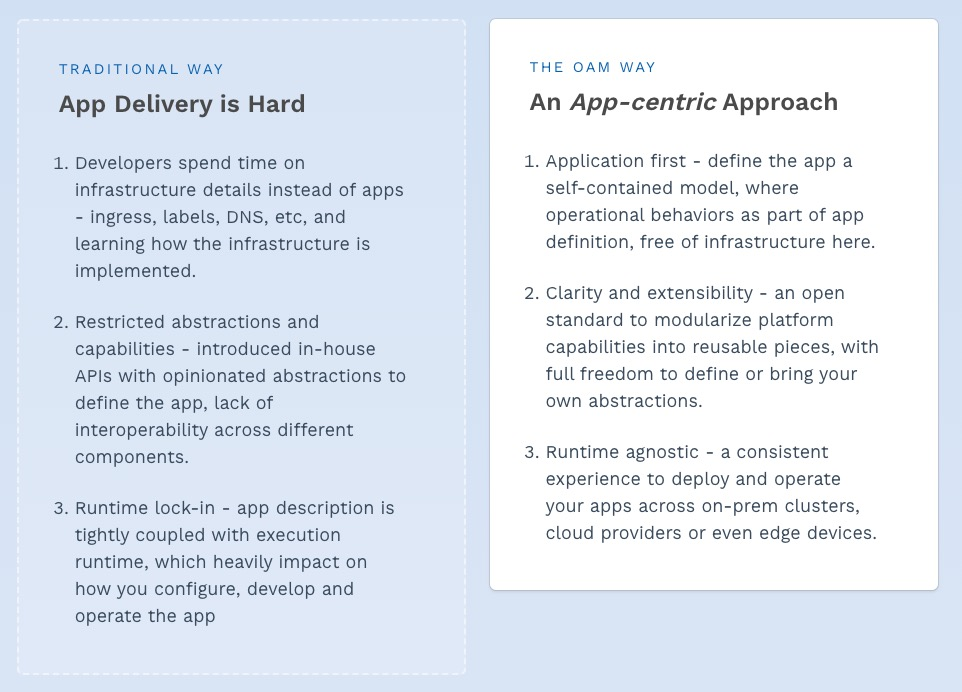

# Kubernetes系列：OAM


## 系列目录

[《Kubernetes系列：开篇》](../k8s_series)

[《Kubernetes系列：概述》](../k8s_series_intro)

[《Kubernetes系列：架构》](../k8s_series_arch)

[《Kubernetes系列：容器》](../k8s_series_container)

[《Kubernetes系列：网络》](../k8s_series_network)

[《Kubernetes系列：存储》](../k8s_series_storage)

[《Kubernetes系列：Service》](../k8s_series_service)

[《Kubernetes系列：Ingress》](../k8s_series_ingress)

[《Kubernetes系列：OAM》](../k8s_series_oma)

***

## 1. 介绍

> 开放应用程序模型(OAM)是与运行时无关的规范，用于定义云原生应用程序。

OAM专注于应用程序，而不是容器或协调器。

OAM带来了模块化，可扩展和可移植的设计，可用于对云原生应用程序建模，并以统一的方式将应用程序交付给Kubernetes，云或IoT设备等任何运行时。



***

## 2. KubeVela

### 2.1 是什么

云原生技术的趋势正在朝着使用Kubernetes作为通用抽象层跨云和本地基础架构追求一致的应用程序交付的趋势。

对于平台构建者而言，KubeVela是一个框架，使他们能够轻松创建用户友好但高度可扩展的平台。详细地说，KubeVela通过执行以下操作减轻了构建此类平台的麻烦：

* 以应用为中心。 KubeVela强制采用一种应用程序概念作为其主要API，并且所有KubeVela的功能仅可满足应用程序的需求。这是通过采用开放应用程序模型作为KubeVela的核心API来实现的。
* 本地扩展。KubeVela中的应用程序由各种模块化组件（称为：服务）组成。 Kubernetes生态系统的功能可以随时通过Kubernetes CRD注册机制作为新的工作负载类型或特征添加到KubeVela中。
* 简单但可扩展的抽象机制。KubeVela引入了一个模板引擎（支持CUELang等），用于从下划线的Kubernetes资源中提取面向用户的模式。KubeVela提供了一组内置的抽象作为起点，并且平台构建者可以随时自由地对其进行修改。抽象更改在运行时生效，无需重新编译或重新部署KubeVela。

借助KubeVela，平台构建者现在终于获得了工具支持，以高信心和低周转时间设计并向其最终用户交付任何新功能。

对于开发人员而言，使用KubeVela构建的此类平台将使他们能够以最小的努力设计并将其应用程序发布到Kubernetes。他们只需要一个简单的应用程序定义，而不是管理少量的基础结构细节，而是遵循以开发人员为中心的工作流，该工作流可以轻松地与任何CI / CD管道集成。

***

### 2.2 对比

#### PaaS

它们提供了完整的应用程序管理功能，旨在改善开发人员的体验和效率。KubeVela可以提供类似的体验，但是与大多数现有的PaaS产品相比，其内置功能轻巧得多，并且易于维护。KubeVela核心组件不过是一组Kubernetes控制器/插件。

KubeVela被设计为核心引擎，其主要目标是使平台团队能够通过简单地注册CRD和定义模板来创建“类似PaaS”的体验。与此经验相比，大多数现有的PaaS系统要么不可扩展，要么具有自己的附加系统。因此，对他们来说，在受支持的应用程序类型和受支持的功能上强加约束是很常见的，而这在基于KubeVela的体验中是不会发生的。

#### Serverless Platforms

无服务器平台（例如AWS Lambda）可提供非凡的用户体验和敏捷性，以部署无服务器应用程序。但是，这些平台在可扩展性方面施加了更多限制。它们可以说是“硬编码” PaaS。

通过将自己注册为新的工作负载类型和特征，可以轻松地将基于Kubernetes的Knative，OpenFaaS等无服务器平台与KubeVela集成。即使对于AWS Lambda，也有成功的故事，可以通过Crossplane开发的工具将其与KubeVela集成。

#### 与平台无关的开发人员工具

典型的例子是Hashicorp的Waypoint。 Waypoint是面向开发人员的工具，它引入了一致的工作流程（即构建，部署，发布），以在不同平台之上发布应用程序。

KubeVela可以像任何其他受支持的平台一样集成到Waypoint中。在这种情况下，开发人员将使用Waypoint工作流而不是KubeVela Appfile / CLI来管理应用程序，并且该集成中仍然可以使用KubeVela的所有功能，包括抽象。

#### Helm

Helm是Kubernetes的软件包管理器，它为Kubernetes作为一个单元提供打包，安装和升级一组YAML文件。 KubeVela充分利用Helm作为功能和依赖项的软件包格式。

尽管KubeVela本身不是包管理器，但它是平台构建者以简单且可重复的方式创建上层平台的核心引擎。

#### Kubernetes

KubeVela是用于构建上层平台的Kubernetes插件。它利用Kubernetes的本机可扩展性和功能解决了一个棘手的问题-使运输应用程序在Kubernetes上令人愉悦。

***

### 2.3 安装配置

#### 2.3.1 KubeVale安装

1. 添加 helm chart repo 

   ```shell
   helm repo add kubevela https://kubevelacharts.oss-cn-hangzhou.aliyuncs.com/coreCopy to clipboardErrorCopied
   ```

2. 更新 chart repo

   ```shell
   helm repo updateCopy to clipboardErrorCopied
   ```

3. 安装 KubeVela

   ```shell
   helm install --create-namespace -n vela-system kubevela kubevela/vela-core
   ```

#### 2.3.2 部署应用

```bash
$ kubectl apply -f https://raw.githubusercontent.com/oam-dev/kubevela/master/docs/examples/vela-app.yaml
application.core.oam.dev/first-vela-app createdCopy to clipboardErrorCopied
```

检查 `status` 处于 `running` 状态并且services的`healthy`为`true`

```bash
$  kubectl get application first-vela-app -o yaml
apiVersion: core.oam.dev/v1alpha2
kind: Application
metadata:
  generation: 1
  name: first-vela-app
  ...
  namespace: default
spec:
  components:
  - name: express-server
    type: webservice
    settings:
      image: crccheck/hello-world
      port: 8000
    traits:
    - name: ingress
      properties:
        domain: testsvc.example.com
        http:
          /: 8000
status:
  ...
  services:
  - healthy: true
    name: express-server
    traits:
    - healthy: true
      message: 'Visiting URL: testsvc.example.com, IP: your ip address'
      type: ingress
  status: runningCopy to clipboardErrorCopied
```

k8s资源将被创建

```bash
$ kubectl get deployment
NAME                READY   UP-TO-DATE   AVAILABLE   AGE
express-server-v1   1/1     1            1           8m
$ kubectl get svc
NAME             TYPE        CLUSTER-IP      EXTERNAL-IP   PORT(S)    AGE
express-server   ClusterIP   172.21.11.152   <none>        8000/TCP   7m43s
kubernetes       ClusterIP   172.21.0.1      <none>        443/TCP    116d
$ kubectl get ingress
NAME             CLASS    HOSTS                 ADDRESS          PORTS   AGE
express-server   <none>   testsvc.example.com   <your ip address>   80      7m47sCopy to clipboardErrorCopied
```

访问服务

```shell
$ curl -H "Host:testsvc.example.com" http://<your ip address>/
<xmp>
Hello World


                                       ##         .
                                 ## ## ##        ==
                              ## ## ## ## ##    ===
                           /""""""""""""""""\___/ ===
                      ~~~ {~~ ~~~~ ~~~ ~~~~ ~~ ~ /  ===- ~~~
                           \______ o          _,/
                            \      \       _,'
                             `'--.._\..--''
</xmp>
```

***

### 2.3 详解

#### 2.3.1 Workflow

* Platform

  * 职责：为部署环境和可重用模块（例如组件类型，操作行为）定义模板，并将其注册到集群中。

  * 示例：基础架构运营商，平台构建者。

* EndUser

  * 职责：选择部署环境，使用可用模块对应用程序进行建模和组装，然后将应用程序部署到目标环境。
  * 示例：应用程序开发人员，应用程序运营商。


***

#### 2.3.2 Application

Application是KubeVela的核心API。它的主要目的是用于应用程序封装和抽象，即它允许开发人员使用单个工件来使用简化的原语来捕获完整的应用程序定义。

应用程序封装对于简化管理任务很重要，并且可以充当锚点以避免操作期间的配置漂移。此外，作为抽象对象，Application无需依赖底层细节就为Kubernetes的入门功能提供了更为简单的途径。例如，开发人员将能够在无需每次都定义详细的Kubernetes部署+服务组合的情况下对“ Web服务”进行建模，或者可以在不引用基础KEDA ScaleObject的情况下声明自动扩展需求。

例子：

```yaml
apiVersion: core.oam.dev/v1alpha2
kind: Application
metadata:
  name: website
spec:
  components:
    - name: backend
      type: worker
      settings:
        image: busybox
        cmd:
          - sleep
          - '1000'
    - name: frontend
      type: webservice
      settings:
        image: nginx
      traits:
        - name: autoscaler
          properties:
            min: 1
            max: 10
        - name: sidecar
          properties:
            name: "sidecar-test"
            image: "fluentd"
```

#### 2.3.3 Workload Types

对于`Application`中的每个组件，它的`.type`字段表示此组件的运行时特征（即工作负载类型），`. settings`要求对其进行实例化的配置。些典型的组件类型是*Long Running Web Service*, *One-time Off Task* or *Redis Database*

所有受支持的组件类型都应预先安装在平台中，或者由组件供应商（例如第三方软件所有者）提供。

#### 2.3.4 Traits

可选地，每个组件都有一个`.traits`部分，该部分通过操作行为（例如负载平衡策略，网络入口路由，自动扩展策略或升级策略等）来扩展其组件实例。其.name字段引用特定的特征定义，`.properties`设置给定特征的详细配置值。

受支持的特征大部分是平台提供的操作功能，但平台还允许用户带来自己的特征。

我们还将KubeVela中的工作负载类型和特征称为“application/capability modules”。

#### 2.3.5 Definitions

应用程序中的工作负载设置模式和特征属性都由在一组定义对象中分别预定义的应用程序模块强制实施。平台团队或组件提供者负责按照开放应用程序模型（OAM）中的工作负载定义和特征定义规范在目标集群中注册和管理定义。

当前，KubeVela在定义中支持CUE作为模块类型，而在后续版本中将提供更多类型，例如Helm和Terraform。在Helm的情况下，图表可以在Application中直接引用为组件类型，其值.yaml将成为组件的规格

#### 2.3.6 Environment

在将应用程序发布到生产环境之前，在测试/登台工作空间中测试代码很重要。在KubeVela中，我们将这些工作空间简称为“部署环境”或“环境”。每个环境都有其自己的配置（例如，域，Kubernetes集群和名称空间，配置数据，访问控制策略等），以允许用户创建不同的部署环境，例如“测试”和“生产”。

当前，KubeVela环境仅映射到Kubernetes命名空间，而集群级环境仍在开发中。

#### 2.3.7 组件概览


#### 2.3.8 架构


KubeVela中的封装引擎负责应用程序的抽象和封装（即`Application`和`Definition`的控制器）

部署引擎（当前为WIP）负责逐步部署应用程序（即`AppDeployment`的控制器）。

***

## 3. 结论

该篇我们讲述了OAM模型，并讲述了OAM模型的实现KubeVela.

***

**参考**

https://kubevela.io/#/en/introduction

https://oam.dev/
