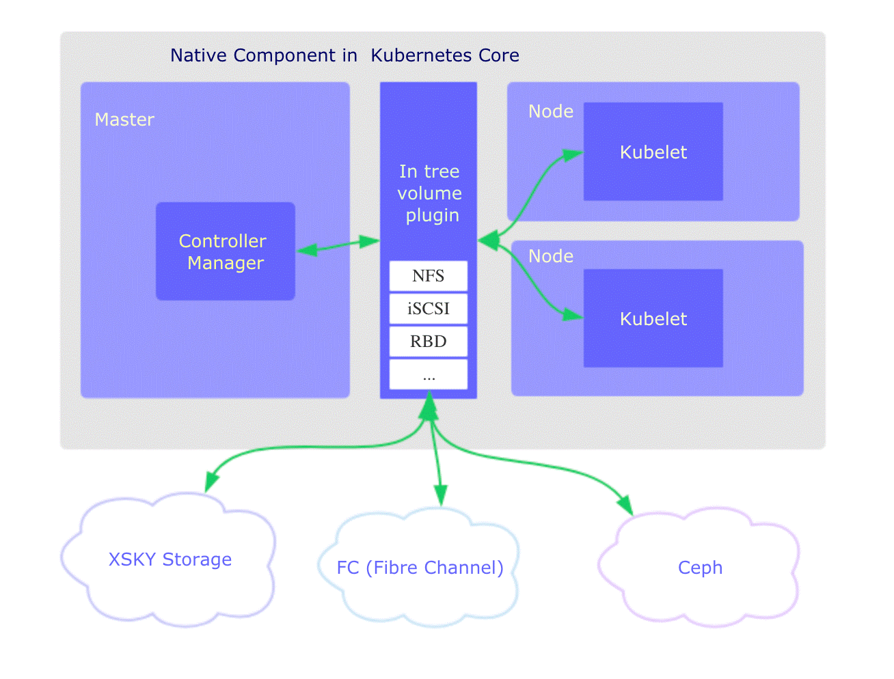
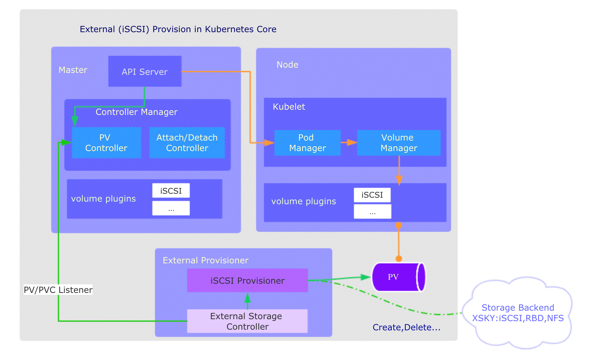

# Kubernetes系列：存储


## 系列目录

[《Kubernetes系列：开篇》](../k8s_series)

[《Kubernetes系列：概述》](../k8s_series_intro)

[《Kubernetes系列：架构》](../k8s_series_arch)

[《Kubernetes系列：容器》](../k8s_series_container)

[《Kubernetes系列：网络》](../k8s_series_network)

[《Kubernetes系列：存储》](../k8s_series_storage)

[《Kubernetes系列：Service》](../k8s_series_service)

[《Kubernetes系列：Ingress》](../k8s_series_ingress)

[《Kubernetes系列：OAM》](../k8s_series_oma)

***

## 1. 介绍

容器中的文件在磁盘上是临时存放的，这给容器中运行的较重要的应用程序带来一些问题：

1. 当容器崩溃时文件丢失。kubelet 会重新启动容器， 但容器会以干净的状态重启。
2. 在 `Pod` 中同时运行多个容器时，这些容器之间通常需要共享文件。

Kubernetes 中的 `Volume` 抽象很好的解决了这些问题。

***

## 2. 存储

为了管理存储，Kubernetes提供了Secret用于管理敏感信息，ConfigMap存储配置，Volume、PV、PVC、StorageClass等用来管理存储卷。

### 2.1 Volume

Kubernetes 支持很多类型的卷。 [Pod](https://kubernetes.io/docs/concepts/workloads/pods/pod-overview/) 可以同时使用任意数目的卷类型。 临时卷类型的生命周期与 Pod 相同，但持久卷可以比 Pod 的存活期长。 因此，卷的存在时间会超出 Pod 中运行的所有容器，并且在容器重新启动时数据也会得到保留。 当 Pod 不再存在时，卷也将不再存在。

卷的核心是包含一些数据的一个目录，Pod 中的容器可以访问该目录。 所采用的特定的卷类型将决定该目录如何形成的、使用何种介质保存数据以及目录中存放 的内容。

使用卷时, 在 `.spec.volumes` 字段中设置为 Pod 提供的卷，并在 `.spec.containers[*].volumeMounts` 字段中声明卷在容器中的挂载位置。 容器中的进程看到的是由它们的 Docker 镜像和卷组成的文件系统视图。 [Docker 镜像](https://docs.docker.com/userguide/dockerimages/) 位于文件系统层次结构的根部。各个卷则挂载在镜像内的指定路径上。 卷不能挂载到其他卷之上，也不能与其他卷有硬链接。 Pod 配置中的每个容器必须独立指定各个卷的挂载位置。

#### 2.1.1 卷类型

Kubernetes 支持下列类型的卷：[详细](https://kubernetes.io/zh/docs/concepts/storage/volumes/)

**awsElasticBlockStore**

`awsElasticBlockStore` 卷将 Amazon Web服务（AWS）[EBS 卷](https://aws.amazon.com/ebs/) 挂载到你的 Pod 中。与 `emptyDir` 在 Pod 被删除时也被删除不同，EBS 卷的内容在删除 Pod 时 会被保留，卷只是被卸载掉了。 这意味着 EBS 卷可以预先填充数据，并且该数据可以在 Pod 之间共享。

> **说明：** 你在使用 EBS 卷之前必须使用 `aws ec2 create-volume` 命令或者 AWS API 创建该卷。

使用 `awsElasticBlockStore` 卷时有一些限制：

- Pod 运行所在的节点必须是 AWS EC2 实例。
- 这些实例需要与 EBS 卷在相同的地域（Region）和可用区（Availability-Zone）。
- EBS 卷只支持被挂载到单个 EC2 实例上。

**azureDisk**

`azureDisk` 卷类型用来在 Pod 上挂载 Microsoft Azure [数据盘（Data Disk）](https://azure.microsoft.com/en-us/documentation/articles/virtual-machines-linux-about-disks-vhds/) 。 若需了解更多详情，请参考 [`azureDisk` 卷插件](https://github.com/kubernetes/examples/tree/master/staging/volumes/azure_disk/README.md)。

**azureFile**

`azureFile` 卷类型用来在 Pod 上挂载 Microsoft Azure 文件卷（File Volume）（SMB 2.1 和 3.0）。 更多详情请参考 [`azureFile` 卷插件](https://github.com/kubernetes/examples/tree/master/staging/volumes/azure_file/README.md)。

**cephfs**

`cephfs` 卷允许你将现存的 CephFS 卷挂载到 Pod 中。 不像 `emptyDir` 那样会在 Pod 被删除的同时也会被删除，`cephfs` 卷的内容在 Pod 被删除 时会被保留，只是卷被卸载了。这意味着 `cephfs` 卷可以被预先填充数据，且这些数据可以在 Pod 之间共享。同一 `cephfs` 卷可同时被多个写者挂载。

> **说明：** 在使用 Ceph 卷之前，你的 Ceph 服务器必须已经运行并将要使用的 share 导出（exported）。

更多信息请参考 [CephFS 示例](https://github.com/kubernetes/examples/tree/master/volumes/cephfs/)。

**cinder**

> **说明：** Kubernetes 必须配置了 OpenStack Cloud Provider。

`cinder` 卷类型用于将 OpenStack Cinder 卷挂载到 Pod 中。

**configMap**

[`configMap`](https://kubernetes.io/zh/docs/tasks/configure-pod-container/configure-pod-configmap/) 卷 提供了向 Pod 注入配置数据的方法。 ConfigMap 对象中存储的数据可以被 `configMap` 类型的卷引用，然后被 Pod 中运行的 容器化应用使用。

引用 configMap 对象时，你可以在 volume 中通过它的名称来引用。 你可以自定义 ConfigMap 中特定条目所要使用的路径。 下面的配置显示了如何将名为 `log-config` 的 ConfigMap 挂载到名为 `configmap-pod` 的 Pod 中：

```yaml
apiVersion: v1
kind: Pod
metadata:
  name: configmap-pod
spec:
  containers:
    - name: test
      image: busybox
      volumeMounts:
        - name: config-vol
          mountPath: /etc/config
  volumes:
    - name: config-vol
      configMap:
        name: log-config
        items:
          - key: log_level
            path: log_level
```

`log-config` ConfigMap 以卷的形式挂载，并且存储在 `log_level` 条目中的所有内容 都被挂载到 Pod 的 `/etc/config/log_level` 路径下。 请注意，这个路径来源于卷的 `mountPath` 和 `log_level` 键对应的 `path`。

> **说明：**
>
> - 在使用 [ConfigMap](https://kubernetes.io/zh/docs/tasks/configure-pod-container/configure-pod-configmap/) 之前你首先要创建它。
> - 容器以 [subPath](https://kubernetes.io/zh/docs/concepts/storage/volumes/#using-subpath) 卷挂载方式使用 ConfigMap 时，将无法接收 ConfigMap 的更新。
> - 文本数据挂载成文件时采用 UTF-8 字符编码。如果使用其他字符编码形式，可使用 `binaryData` 字段。

**downwardAPI**

`downwardAPI` 卷用于使 downward API 数据对应用程序可用。 这种卷类型挂载一个目录并在纯文本文件中写入所请求的数据。

> **说明：** 容器以 [subPath](https://kubernetes.io/zh/docs/concepts/storage/volumes/#using-subpath) 卷挂载方式使用 downwardAPI 时，将不能接收到它的更新。

更多详细信息请参考 [`downwardAPI` 卷示例](https://kubernetes.io/zh/docs/tasks/inject-data-application/downward-api-volume-expose-pod-information/)。

**emptyDir**

当 Pod 分派到某个 Node 上时，`emptyDir` 卷会被创建，并且在 Pod 在该节点上运行期间，卷一直存在。 就像其名称表示的那样，卷最初是空的。 尽管 Pod 中的容器挂载 `emptyDir` 卷的路径可能相同也可能不同，这些容器都可以读写 `emptyDir` 卷中相同的文件。 当 Pod 因为某些原因被从节点上删除时，`emptyDir` 卷中的数据也会被永久删除。

> **说明：** 容器崩溃并**不**会导致 Pod 被从节点上移除，因此容器崩溃期间 `emptyDir` 卷中的数据是安全的。

`emptyDir` 的一些用途：

- 缓存空间，例如基于磁盘的归并排序。
- 为耗时较长的计算任务提供检查点，以便任务能方便地从崩溃前状态恢复执行。
- 在 Web 服务器容器服务数据时，保存内容管理器容器获取的文件。

取决于你的环境，`emptyDir` 卷存储在该节点所使用的介质上；这里的介质可以是磁盘或 SSD 或网络存储。但是，你可以将 `emptyDir.medium` 字段设置为 `"Memory"`，以告诉 Kubernetes 为你挂载 tmpfs（基于 RAM 的文件系统）。 虽然 tmpfs 速度非常快，但是要注意它与磁盘不同。 tmpfs 在节点重启时会被清除，并且你所写入的所有文件都会计入容器的内存消耗，受容器内存限制约束。

> **说明：** 当启用 `SizeMemoryBackedVolumes` [特性门控](https://kubernetes.io/zh/docs/reference/command-line-tools-reference/feature-gates/)时， 你可以为基于内存提供的卷指定大小。 如果未指定大小，则基于内存的卷的大小为 Linux 主机上内存的 50％。

emptyDir 配置示例

```yaml
apiVersion: v1
kind: Pod
metadata:
  name: test-pd
spec:
  containers:
  - image: k8s.gcr.io/test-webserver
    name: test-container
    volumeMounts:
    - mountPath: /cache
      name: cache-volume
  volumes:
  - name: cache-volume
    emptyDir: {}
```

**fc (光纤通道)**

`fc` 卷类型允许将现有的光纤通道块存储卷挂载到 Pod 中。 可以使用卷配置中的参数 `targetWWNs` 来指定单个或多个目标 WWN（World Wide Names）。 如果指定了多个 WWN，targetWWNs 期望这些 WWN 来自多路径连接。

> **注意：** 你必须配置 FC SAN Zoning，以便预先向目标 WWN 分配和屏蔽这些 LUN（卷）， 这样 Kubernetes 主机才可以访问它们。

更多详情请参考 [FC 示例](https://github.com/kubernetes/examples/tree/master/staging/volumes/fibre_channel)。

**gcePersistentDisk**

`gcePersistentDisk` 卷能将谷歌计算引擎 (GCE) [持久盘（PD）](http://cloud.google.com/compute/docs/disks) 挂载到你的 Pod 中。 不像 `emptyDir` 那样会在 Pod 被删除的同时也会被删除，持久盘卷的内容在删除 Pod 时会被保留，卷只是被卸载了。 这意味着持久盘卷可以被预先填充数据，并且这些数据可以在 Pod 之间共享。

> **注意：** 在使用 PD 前，你必须使用 `gcloud` 或者 GCE API 或 UI 创建它。

使用 `gcePersistentDisk` 时有一些限制：

- 运行 Pod 的节点必须是 GCE VM
- 这些 VM 必须和持久盘位于相同的 GCE 项目和区域（zone）

GCE PD 的一个特点是它们可以同时被多个消费者以只读方式挂载。 这意味着你可以用数据集预先填充 PD，然后根据需要并行地在尽可能多的 Pod 中提供该数据集。 不幸的是，PD 只能由单个使用者以读写模式挂载 —— 即不允许同时写入。

在由 ReplicationController 所管理的 Pod 上使用 GCE PD 将会失败，除非 PD 是只读模式或者副本的数量是 0 或 1。

**glusterfs**

`glusterfs` 卷能将 [Glusterfs](https://www.gluster.org/) (一个开源的网络文件系统) 挂载到你的 Pod 中。不像 `emptyDir` 那样会在删除 Pod 的同时也会被删除，`glusterfs` 卷的内容在删除 Pod 时会被保存，卷只是被卸载。 这意味着 `glusterfs` 卷可以被预先填充数据，并且这些数据可以在 Pod 之间共享。 GlusterFS 可以被多个写者同时挂载。

> **说明：** 在使用前你必须先安装运行自己的 GlusterFS。

更多详情请参考 [GlusterFS 示例](https://github.com/kubernetes/examples/tree/master/volumes/glusterfs)。

**hostPath**

`hostPath` 卷能将主机节点文件系统上的文件或目录挂载到你的 Pod 中。 虽然这不是大多数 Pod 需要的，但是它为一些应用程序提供了强大的逃生舱。

例如，`hostPath` 的一些用法有：

- 运行一个需要访问 Docker 内部机制的容器；可使用 `hostPath` 挂载 `/var/lib/docker` 路径。
- 在容器中运行 cAdvisor 时，以 `hostPath` 方式挂载 `/sys`。
- 允许 Pod 指定给定的 `hostPath` 在运行 Pod 之前是否应该存在，是否应该创建以及应该以什么方式存在。

除了必需的 `path` 属性之外，用户可以选择性地为 `hostPath` 卷指定 `type`。

支持的 `type` 值如下：

| 取值                | 行为                                                         |
| :------------------ | :----------------------------------------------------------- |
|                     | 空字符串（默认）用于向后兼容，这意味着在安装 hostPath 卷之前不会执行任何检查。 |
| `DirectoryOrCreate` | 如果在给定路径上什么都不存在，那么将根据需要创建空目录，权限设置为 0755，具有与 kubelet 相同的组和属主信息。 |
| `Directory`         | 在给定路径上必须存在的目录。                                 |
| `FileOrCreate`      | 如果在给定路径上什么都不存在，那么将在那里根据需要创建空文件，权限设置为 0644，具有与 kubelet 相同的组和所有权。 |
| `File`              | 在给定路径上必须存在的文件。                                 |
| `Socket`            | 在给定路径上必须存在的 UNIX 套接字。                         |
| `CharDevice`        | 在给定路径上必须存在的字符设备。                             |
| `BlockDevice`       | 在给定路径上必须存在的块设备。                               |

当使用这种类型的卷时要小心，因为：

- 具有相同配置（例如基于同一 PodTemplate 创建）的多个 Pod 会由于节点上文件的不同 而在不同节点上有不同的行为。
- 下层主机上创建的文件或目录只能由 root 用户写入。你需要在 [特权容器](https://kubernetes.io/zh/docs/tasks/configure-pod-container/security-context/) 中以 root 身份运行进程，或者修改主机上的文件权限以便容器能够写入 `hostPath` 卷。

hostPath 配置示例：

```yaml
apiVersion: v1
kind: Pod
metadata:
  name: test-pd
spec:
  containers:
  - image: k8s.gcr.io/test-webserver
    name: test-container
    volumeMounts:
    - mountPath: /test-pd
      name: test-volume
  volumes:
  - name: test-volume
    hostPath:
      # 宿主上目录位置
      path: /data
      # 此字段为可选
      type: Directory
```

> **注意：** `FileOrCreate` 模式不会负责创建文件的父目录。 如果欲挂载的文件的父目录不存在，Pod 启动会失败。 为了确保这种模式能够工作，可以尝试把文件和它对应的目录分开挂载，如 [`FileOrCreate` 配置](https://kubernetes.io/zh/docs/concepts/storage/volumes/#hostpath-fileorcreate-example) 所示。

hostPath FileOrCreate 配置示例

```yaml
apiVersion: v1
kind: Pod
metadata:
  name: test-webserver
spec:
  containers:
  - name: test-webserver
    image: k8s.gcr.io/test-webserver:latest
    volumeMounts:
    - mountPath: /var/local/aaa
      name: mydir
    - mountPath: /var/local/aaa/1.txt
      name: myfile
  volumes:
  - name: mydir
    hostPath:
      # 确保文件所在目录成功创建。
      path: /var/local/aaa
      type: DirectoryOrCreate
  - name: myfile
    hostPath:
      path: /var/local/aaa/1.txt
      type: FileOrCreate
```

**iscsi**

`iscsi` 卷能将 iSCSI (基于 IP 的 SCSI) 卷挂载到你的 Pod 中。 不像 `emptyDir` 那样会在删除 Pod 的同时也会被删除，`iscsi` 卷的内容在删除 Pod 时 会被保留，卷只是被卸载。 这意味着 `iscsi` 卷可以被预先填充数据，并且这些数据可以在 Pod 之间共享。

> **注意：** 在使用 iSCSI 卷之前，你必须拥有自己的 iSCSI 服务器，并在上面创建卷。

iSCSI 的一个特点是它可以同时被多个用户以只读方式挂载。 这意味着你可以用数据集预先填充卷，然后根据需要在尽可能多的 Pod 上使用它。 不幸的是，iSCSI 卷只能由单个使用者以读写模式挂载。不允许同时写入。

更多详情请参考 [iSCSI 示例](https://github.com/kubernetes/examples/tree/master/volumes/iscsi)。

**local**

`local` 卷所代表的是某个被挂载的本地存储设备，例如磁盘、分区或者目录。

`local` 卷只能用作静态创建的持久卷。尚不支持动态配置。

与 `hostPath` 卷相比，`local` 卷能够以持久和可移植的方式使用，而无需手动将 Pod 调度到节点。系统通过查看 PersistentVolume 的节点亲和性配置，就能了解卷的节点约束。

然而，`local` 卷仍然取决于底层节点的可用性，并不适合所有应用程序。 如果节点变得不健康，那么`local` 卷也将变得不可被 Pod 访问。使用它的 Pod 将不能运行。 使用 `local` 卷的应用程序必须能够容忍这种可用性的降低，以及因底层磁盘的耐用性特征 而带来的潜在的数据丢失风险。

下面是一个使用 `local` 卷和 `nodeAffinity` 的持久卷示例：

```yaml
apiVersion: v1
kind: PersistentVolume
metadata:
  name: example-pv
spec:
  capacity:
    storage: 100Gi
  volumeMode: Filesystem
  accessModes:
  - ReadWriteOnce
  persistentVolumeReclaimPolicy: Delete
  storageClassName: local-storage
  local:
    path: /mnt/disks/ssd1
  nodeAffinity:
    required:
      nodeSelectorTerms:
      - matchExpressions:
        - key: kubernetes.io/hostname
          operator: In
          values:
          - example-node
```

使用 `local` 卷时，你需要设置 PersistentVolume 对象的 `nodeAffinity` 字段。 Kubernetes 调度器使用 PersistentVolume 的 `nodeAffinity` 信息来将使用 `local` 卷的 Pod 调度到正确的节点。

PersistentVolume 对象的 `volumeMode` 字段可被设置为 "Block" （而不是默认值 "Filesystem"），以将 `local` 卷作为原始块设备暴露出来。

使用 `local` 卷时，建议创建一个 StorageClass 并将其 `volumeBindingMode` 设置为 `WaitForFirstConsumer`。要了解更多详细信息，请参考 [local StorageClass 示例](https://kubernetes.io/zh/docs/concepts/storage/storage-classes/#local)。 延迟卷绑定的操作可以确保 Kubernetes 在为 PersistentVolumeClaim 作出绑定决策时， 会评估 Pod 可能具有的其他节点约束，例如：如节点资源需求、节点选择器、Pod 亲和性和 Pod 反亲和性。

你可以在 Kubernetes 之外单独运行静态驱动以改进对 local 卷的生命周期管理。 请注意，此驱动尚不支持动态配置。 有关如何运行外部 `local` 卷驱动，请参考 [local 卷驱动用户指南](https://github.com/kubernetes-sigs/sig-storage-local-static-provisioner)。

> **说明：** 如果不使用外部静态驱动来管理卷的生命周期，用户需要手动清理和删除 local 类型的持久卷。

**nfs**

`nfs` 卷能将 NFS (网络文件系统) 挂载到你的 Pod 中。 不像 `emptyDir` 那样会在删除 Pod 的同时也会被删除，`nfs` 卷的内容在删除 Pod 时会被保存，卷只是被卸载。 这意味着 `nfs` 卷可以被预先填充数据，并且这些数据可以在 Pod 之间共享。

> **注意：** 在使用 NFS 卷之前，你必须运行自己的 NFS 服务器并将目标 share 导出备用。

要了解更多详情请参考 [NFS 示例](https://github.com/kubernetes/examples/tree/master/staging/volumes/nfs)。

**persistentVolumeClaim**

`persistentVolumeClaim` 卷用来将[持久卷](https://kubernetes.io/zh/docs/concepts/storage/persistent-volumes/)（PersistentVolume） 挂载到 Pod 中。 持久卷申领（PersistentVolumeClaim）是用户在不知道特定云环境细节的情况下"申领"持久存储 （例如 GCE PersistentDisk 或者 iSCSI 卷）的一种方法。

更多详情请参考[持久卷示例](https://kubernetes.io/zh/docs/concepts/storage/persistent-volumes/)。

**portworxVolume**

`portworxVolume` 是一个可伸缩的块存储层，能够以超融合（hyperconverged）的方式与 Kubernetes 一起运行。 [Portworx](https://portworx.com/use-case/kubernetes-storage/) 支持对服务器上存储的指纹处理、 基于存储能力进行分层以及跨多个服务器整合存储容量。 Portworx 可以以 in-guest 方式在虚拟机中运行，也可以在裸金属 Linux 节点上运行。

更多详情可以参考 [Portworx 卷](https://github.com/kubernetes/examples/tree/master/staging/volumes/portworx/README.md)。

**projected**

`projected` 卷类型能将若干现有的卷来源映射到同一目录上。

目前，可以映射的卷来源类型如下：

- [`secret`](https://kubernetes.io/zh/docs/concepts/storage/volumes/#secret)
- [`downwardAPI`](https://kubernetes.io/zh/docs/concepts/storage/volumes/#downwardapi)
- [`configMap`](https://kubernetes.io/zh/docs/concepts/storage/volumes/#configmap)
- `serviceAccountToken`

所有的卷来源需要和 Pod 处于相同的命名空间。 更多详情请参考[一体化卷设计文档](https://github.com/kubernetes/community/blob/master/contributors/design-proposals/node/all-in-one-volume.md)。

包含 Secret、downwardAPI 和 configMap 的 Pod 示例

```yaml
apiVersion: v1
kind: Pod
metadata:
  name: volume-test
spec:
  containers:
  - name: container-test
    image: busybox
    volumeMounts:
    - name: all-in-one
      mountPath: "/projected-volume"
      readOnly: true
  volumes:
  - name: all-in-one
    projected:
      sources:
      - secret:
          name: mysecret
          items:
            - key: username
              path: my-group/my-username
      - downwardAPI:
          items:
            - path: "labels"
              fieldRef:
                fieldPath: metadata.labels
            - path: "cpu_limit"
              resourceFieldRef:
                containerName: container-test
                resource: limits.cpu
      - configMap:
          name: myconfigmap
          items:
            - key: config
              path: my-group/my-config
```

下面是一个带有非默认访问权限设置的多个 secret 的 Pod 示例：

```yaml
apiVersion: v1
kind: Pod
metadata:
  name: volume-test
spec:
  containers:
  - name: container-test
    image: busybox
    volumeMounts:
    - name: all-in-one
      mountPath: "/projected-volume"
      readOnly: true
  volumes:
  - name: all-in-one
    projected:
      sources:
      - secret:
          name: mysecret
          items:
            - key: username
              path: my-group/my-username
      - secret:
          name: mysecret2
          items:
            - key: password
              path: my-group/my-password
              mode: 511
```

每个被投射的卷来源都在规约中的 `sources` 内列出。参数几乎相同，除了两处例外：

- 对于 `secret`，`secretName` 字段已被变更为 `name` 以便与 ConfigMap 命名一致。
- `defaultMode` 只能在整个投射卷级别指定，而无法针对每个卷来源指定。 不过，如上所述，你可以显式地为每个投射项设置 `mode` 值。

当开启 `TokenRequestProjection` 功能时，可以将当前 [服务帐号](https://kubernetes.io/zh/docs/reference/access-authn-authz/authentication/#service-account-tokens) 的令牌注入 Pod 中的指定路径。 下面是一个例子：

```yaml
apiVersion: v1
kind: Pod
metadata:
  name: sa-token-test
spec:
  containers:
  - name: container-test
    image: busybox
    volumeMounts:
    - name: token-vol
      mountPath: "/service-account"
      readOnly: true
  volumes:
  - name: token-vol
    projected:
      sources:
      - serviceAccountToken:
          audience: api
          expirationSeconds: 3600
          path: token
```

示例 Pod 具有包含注入服务帐户令牌的映射卷。 该令牌可以被 Pod 中的容器用来访问 Kubernetes API 服务器。 `audience` 字段包含令牌的预期受众。 令牌的接收者必须使用令牌的受众中指定的标识符来标识自己，否则应拒绝令牌。 此字段是可选的，默认值是 API 服务器的标识符。

`expirationSeconds` 是服务帐户令牌的有效期时长。 默认值为 1 小时，必须至少 10 分钟（600 秒）。 管理员还可以通过设置 API 服务器的 `--service-account-max-token-expiration` 选项来 限制其最大值。 `path` 字段指定相对于映射卷的挂载点的相对路径。

> **说明：**
>
> 使用投射卷源作为 [subPath](https://kubernetes.io/zh/docs/concepts/storage/volumes/#using-subpath) 卷挂载的容器将不会接收这些卷源的更新。

**quobyte**

`quobyte` 卷允许将现有的 [Quobyte](https://www.quobyte.com/) 卷挂载到你的 Pod 中。

> **说明：** 在使用 Quobyte 卷之前，你首先要进行安装 Quobyte 并创建好卷。

Quobyte 支持[容器存储接口（CSI）](https://kubernetes.io/zh/docs/concepts/storage/volumes/#csi)。 推荐使用 CSI 插件以在 Kubernetes 中使用 Quobyte 卷。 Quobyte 的 GitHub 项目包含以 CSI 形式部署 Quobyte 的 [说明](https://github.com/quobyte/quobyte-csi#quobyte-csi) 及使用示例。

**rbd**

`rbd` 卷允许将 [Rados 块设备](https://ceph.com/docs/master/rbd/rbd/) 卷挂载到你的 Pod 中. 不像 `emptyDir` 那样会在删除 Pod 的同时也会被删除，`rbd` 卷的内容在删除 Pod 时 会被保存，卷只是被卸载。 这意味着 `rbd` 卷可以被预先填充数据，并且这些数据可以在 Pod 之间共享。

> **注意：** 在使用 RBD 之前，你必须安装运行 Ceph。

RBD 的一个特性是它可以同时被多个用户以只读方式挂载。 这意味着你可以用数据集预先填充卷，然后根据需要在尽可能多的 Pod 中并行地使用卷。 不幸的是，RBD 卷只能由单个使用者以读写模式安装。不允许同时写入。

更多详情请参考 [RBD 示例](https://github.com/kubernetes/examples/tree/master/volumes/rbd)。

**secret**

`secret` 卷用来给 Pod 传递敏感信息，例如密码。你可以将 Secret 存储在 Kubernetes API 服务器上，然后以文件的形式挂在到 Pod 中，无需直接与 Kubernetes 耦合。 `secret` 卷由 tmpfs（基于 RAM 的文件系统）提供存储，因此它们永远不会被写入非易失性 （持久化的）存储器。

> **说明：** 使用前你必须在 Kubernetes API 中创建 secret。

> **说明：** 容器以 [subPath](https://kubernetes.io/zh/docs/concepts/storage/volumes/#using-subpath) 卷挂载方式挂载 Secret 时，将感知不到 Secret 的更新。

更多详情请参考[配置 Secrets](https://kubernetes.io/zh/docs/concepts/configuration/secret/)。

**storageOS**

`storageos` 卷允许将现有的 [StorageOS](https://www.storageos.com/) 卷挂载到你的 Pod 中。

StorageOS 在 Kubernetes 环境中以容器的形式运行，这使得应用能够从 Kubernetes 集群中的任何节点访问本地的或挂接的存储。为应对节点失效状况，可以复制数据。 若需提高利用率和降低成本，可以考虑瘦配置（Thin Provisioning）和数据压缩。

作为其核心能力之一，StorageOS 为容器提供了可以通过文件系统访问的块存储。

关于 StorageOS 的进一步信息、动态供应和持久卷申领等等，请参考 [StorageOS 示例](https://github.com/kubernetes/examples/blob/master/volumes/storageos)。

**vsphereVolume**

> **说明：** 你必须配置 Kubernetes 的 vSphere 云驱动。云驱动的配置方法请参考 [vSphere 使用指南](https://vmware.github.io/vsphere-storage-for-kubernetes/documentation/)。

`vsphereVolume` 用来将 vSphere VMDK 卷挂载到你的 Pod 中。 在卸载卷时，卷的内容会被保留。 vSphereVolume 卷类型支持 VMFS 和 VSAN 数据仓库。

***

#### 2.1.2 使用 subPath

有时，在单个 Pod 中共享卷以供多方使用是很有用的。 `volumeMounts.subPath` 属性可用于指定所引用的卷内的子路径，而不是其根路径。

下面例子展示了如何配置某包含 LAMP 堆栈（Linux Apache MySQL PHP）的 Pod 使用同一共享卷。 此示例中的 `subPath` 配置不建议在生产环境中使用。 PHP 应用的代码和相关数据映射到卷的 `html` 文件夹，MySQL 数据库存储在卷的 `mysql` 文件夹中：

```yaml
apiVersion: v1
kind: Pod
metadata:
  name: my-lamp-site
spec:
    containers:
    - name: mysql
      image: mysql
      env:
      - name: MYSQL_ROOT_PASSWORD
        value: "rootpasswd"
      volumeMounts:
      - mountPath: /var/lib/mysql
        name: site-data
        subPath: mysql
    - name: php
      image: php:7.0-apache
      volumeMounts:
      - mountPath: /var/www/html
        name: site-data
        subPath: html
    volumes:
    - name: site-data
      persistentVolumeClaim:
        claimName: my-lamp-site-data
```

**使用带有扩展环境变量的 subPath**

**FEATURE STATE:** `Kubernetes v1.17 [stable]`

使用 `subPathExpr` 字段可以基于 Downward API 环境变量来构造 `subPath` 目录名。 `subPath` 和 `subPathExpr` 属性是互斥的。

在这个示例中，Pod 使用 `subPathExpr` 来 hostPath 卷 `/var/log/pods` 中创建目录 `pod1`。 `hostPath` 卷采用来自 `downwardAPI` 的 Pod 名称生成目录名。 宿主目录 `/var/log/pods/pod1` 被挂载到容器的 `/logs` 中。

```yaml
apiVersion: v1
kind: Pod
metadata:
  name: pod1
spec:
  containers:
  - name: container1
    env:
    - name: POD_NAME
      valueFrom:
        fieldRef:
          apiVersion: v1
          fieldPath: metadata.name
    image: busybox
    command: [ "sh", "-c", "while [ true ]; do echo 'Hello'; sleep 10; done | tee -a /logs/hello.txt" ]
    volumeMounts:
    - name: workdir1
      mountPath: /logs
      subPathExpr: $(POD_NAME)
  restartPolicy: Never
  volumes:
  - name: workdir1
    hostPath:
      path: /var/log/pods
```

#### 2.1.3 资源

`emptyDir` 卷的存储介质（磁盘、SSD 等）是由保存 kubelet 数据的根目录 （通常是 `/var/lib/kubelet`）的文件系统的介质确定。 Kubernetes 对 `emptyDir` 卷或者 `hostPath` 卷可以消耗的空间没有限制， 容器之间或 Pod 之间也没有隔离。

要了解如何使用资源规约来请求空间，可参考 [如何管理资源](https://kubernetes.io/zh/docs/concepts/configuration/manage-resources-containers/)。

#### 2.1.4 树外（Out-of-Tree）卷插件

Out-of-Tree 卷插件包括 [容器存储接口（CSI）](https://kubernetes.io/zh/docs/concepts/storage/volumes/#csi) (CSI) 和 FlexVolume。 它们使存储供应商能够创建自定义存储插件，而无需将它们添加到 Kubernetes 代码仓库。

以前，所有卷插件（如上面列出的卷类型）都是“树内（In-Tree）”的。 “树内”插件是与 Kubernetes 的核心组件一同构建、链接、编译和交付的。 这意味着向 Kubernetes 添加新的存储系统（卷插件）需要将代码合并到 Kubernetes 核心代码库中。

CSI 和 FlexVolume 都允许独立于 Kubernetes 代码库开发卷插件，并作为扩展部署 （安装）在 Kubernetes 集群上。

对于希望创建树外（Out-Of-Tree）卷插件的存储供应商，请参考 [卷插件常见问题](https://github.com/kubernetes/community/blob/master/sig-storage/volume-plugin-faq.md)。

#### 2.1.5  CSI

[容器存储接口](https://github.com/container-storage-interface/spec/blob/master/spec.md) (CSI) 为容器编排系统（如 Kubernetes）定义标准接口，以将任意存储系统暴露给它们的容器工作负载。

更多详情请阅读 [CSI 设计方案](https://github.com/kubernetes/community/blob/master/contributors/design-proposals/storage/container-storage-interface.md)。

> **说明：** Kubernetes v1.13 废弃了对 CSI 规范版本 0.2 和 0.3 的支持，并将在以后的版本中删除。

> **说明：** CSI 驱动可能并非兼容所有的 Kubernetes 版本。 请查看特定 CSI 驱动的文档，以了解各个 Kubernetes 版本所支持的部署步骤以及兼容性列表。

一旦在 Kubernetes 集群上部署了 CSI 兼容卷驱动程序，用户就可以使用 `csi` 卷类型来 挂接、挂载 CSI 驱动所提供的卷。

`csi` 卷可以在 Pod 中以三种方式使用：

- 通过 PersistentVolumeClaim(#persistentvolumeclaim) 对象引用
- 使用[一般性的临时卷](https://kubernetes.io/zh/docs/concepts/storage/ephemeral-volumes/#generic-ephemeral-volume) （Alpha 特性）
- 使用 [CSI 临时卷](https://kubernetes.io/zh/docs/concepts/storage/ephemeral-volumes/#csi-ephemeral-volume)， 前提是驱动支持这种用法（Beta 特性）

存储管理员可以使用以下字段来配置 CSI 持久卷：

- `driver`：指定要使用的卷驱动名称的字符串值。 这个值必须与 CSI 驱动程序在 `GetPluginInfoResponse` 中返回的值相对应； 该接口定义在 [CSI 规范](https://github.com/container-storage-interface/spec/blob/master/spec.md#getplugininfo)中。 Kubernetes 使用所给的值来标识要调用的 CSI 驱动程序；CSI 驱动程序也使用该值来辨识 哪些 PV 对象属于该 CSI 驱动程序。

- `volumeHandle`：唯一标识卷的字符串值。 该值必须与 CSI 驱动在 `CreateVolumeResponse` 的 `volume_id` 字段中返回的值相对应； 接口定义在 [CSI spec](https://github.com/container-storage-interface/spec/blob/master/spec.md#createvolume) 中。 在所有对 CSI 卷驱动程序的调用中，引用该 CSI 卷时都使用此值作为 `volume_id` 参数。

- `readOnly`：一个可选的布尔值，指示通过 `ControllerPublished` 关联该卷时是否设置 该卷为只读。默认值是 false。 该值通过 `ControllerPublishVolumeRequest` 中的 `readonly` 字段传递给 CSI 驱动。

- `fsType`：如果 PV 的 `VolumeMode` 为 `Filesystem`，那么此字段指定挂载卷时应该使用的文件系统。 如果卷尚未格式化，并且支持格式化，此值将用于格式化卷。 此值可以通过 `ControllerPublishVolumeRequest`、`NodeStageVolumeRequest` 和 `NodePublishVolumeRequest` 的 `VolumeCapability` 字段传递给 CSI 驱动。

- `volumeAttributes`：一个字符串到字符串的映射表，用来设置卷的静态属性。 该映射必须与 CSI 驱动程序返回的 `CreateVolumeResponse` 中的 `volume.attributes` 字段的映射相对应； [CSI 规范](https://github.com/container-storage-interface/spec/blob/master/spec.md#createvolume) 中有相应的定义。 该映射通过`ControllerPublishVolumeRequest`、`NodeStageVolumeRequest`、和 `NodePublishVolumeRequest` 中的 `volume_attributes` 字段传递给 CSI 驱动。

- `controllerPublishSecretRef`：对包含敏感信息的 Secret 对象的引用； 该敏感信息会被传递给 CSI 驱动来完成 CSI `ControllerPublishVolume` 和 `ControllerUnpublishVolume` 调用。 此字段是可选的；在不需要 Secret 时可以是空的。 如果 Secret 对象包含多个 Secret 条目，则所有的 Secret 条目都会被传递。

- `nodeStageSecretRef`：对包含敏感信息的 Secret 对象的引用。 该信息会传递给 CSI 驱动来完成 CSI `NodeStageVolume` 调用。 此字段是可选的，如果不需要 Secret，则可能是空的。 如果 Secret 对象包含多个 Secret 条目，则传递所有 Secret 条目。

- `nodePublishSecretRef`：对包含敏感信息的 Secret 对象的引用。 该信息传递给 CSI 驱动来完成 CSI `NodePublishVolume` 调用。 此字段是可选的，如果不需要 Secret，则可能是空的。 如果 Secret 对象包含多个 Secret 条目，则传递所有 Secret 条目。

#### 2.1.6 flexVolume

FlexVolume 是一个自 1.2 版本（在 CSI 之前）以来在 Kubernetes 中一直存在的树外插件接口。 它使用基于 exec 的模型来与驱动程序对接。 用户必须在每个节点（在某些情况下是主控节点）上的预定义卷插件路径中安装 FlexVolume 驱动程序可执行文件。

Pod 通过 `flexvolume` 树内插件与 Flexvolume 驱动程序交互。 更多详情请参考 [FlexVolume](https://github.com/kubernetes/community/blob/master/contributors/devel/sig-storage/flexvolume.md) 示例。

#### 2.1.7 挂载卷的传播

挂载卷的传播能力允许将容器安装的卷共享到同一 Pod 中的其他容器， 甚至共享到同一节点上的其他 Pod。

卷的挂载传播特性由 `Container.volumeMounts` 中的 `mountPropagation` 字段控制。 它的值包括：

- `None` - 此卷挂载将不会感知到主机后续在此卷或其任何子目录上执行的挂载变化。 类似的，容器所创建的卷挂载在主机上是不可见的。这是默认模式。

  该模式等同于 [Linux 内核文档](https://www.kernel.org/doc/Documentation/filesystems/sharedsubtree.txt) 中描述的 `private` 挂载传播选项。

- `HostToContainer` - 此卷挂载将会感知到主机后续针对此卷或其任何子目录的挂载操作。

  换句话说，如果主机在此挂载卷中挂载任何内容，容器将能看到它被挂载在那里。

  类似的，配置了 `Bidirectional` 挂载传播选项的 Pod 如果在同一卷上挂载了内容， 挂载传播设置为 `HostToContainer` 的容器都将能看到这一变化。

  该模式等同于 [Linux 内核文档](https://www.kernel.org/doc/Documentation/filesystems/sharedsubtree.txt) 中描述的 `rslave` 挂载传播选项。

- `Bidirectional` - 这种卷挂载和 `HostToContainer` 挂载表现相同。 另外，容器创建的卷挂载将被传播回至主机和使用同一卷的所有 Pod 的所有容器。

  该模式等同于 [Linux 内核文档](https://www.kernel.org/doc/Documentation/filesystems/sharedsubtree.txt) 中描述的 `rshared` 挂载传播选项。

  > **警告：** `Bidirectional` 形式的挂载传播可能比较危险。 它可以破坏主机操作系统，因此它只被允许在特权容器中使用。 强烈建议你熟悉 Linux 内核行为。 此外，由 Pod 中的容器创建的任何卷挂载必须在终止时由容器销毁（卸载）。

***

### 2.2 ConfigMap

ConfigMap 是一种 API 对象，用来将非机密性的数据保存到键值对中。使用时， [Pods](https://kubernetes.io/docs/concepts/workloads/pods/pod-overview/) 可以将其用作环境变量、命令行参数或者存储卷中的配置文件。

ConfigMap 将您的环境配置信息和 [容器镜像](https://kubernetes.io/zh/docs/reference/glossary/?all=true#term-image) 解耦，便于应用配置的修改。

> **注意：**
>
> ConfigMap 并不提供保密或者加密功能。 如果你想存储的数据是机密的，请使用 [Secret](https://kubernetes.io/zh/docs/concepts/configuration/secret/)， 或者使用其他第三方工具来保证你的数据的私密性，而不是用 ConfigMap。

#### 2.2.1 ConfigMap 对象

ConfigMap 是一个 API [对象](https://kubernetes.io/zh/docs/concepts/overview/working-with-objects/kubernetes-objects/)， 让你可以存储其他对象所需要使用的配置。 和其他 Kubernetes 对象都有一个 `spec` 不同的是，ConfigMap 使用 `data` 和 `binaryData` 字段。这些字段能够接收键-值对作为其取值。`data` 和 `binaryData` 字段都是可选的。`data` 字段设计用来保存 UTF-8 字节序列，而 `binaryData` 则 被设计用来保存二进制数据。

ConfigMap 的名字必须是一个合法的 [DNS 子域名](https://kubernetes.io/zh/docs/concepts/overview/working-with-objects/names#dns-subdomain-names)。

`data` 或 `binaryData` 字段下面的每个键的名称都必须由字母数字字符或者 `-`、`_` 或 `.` 组成。在 `data` 下保存的键名不可以与在 `binaryData` 下 出现的键名有重叠。

从 v1.19 开始，你可以添加一个 `immutable` 字段到 ConfigMap 定义中，创建 [不可变更的 ConfigMap](https://kubernetes.io/zh/docs/concepts/configuration/configmap/#configmap-immutable)。

#### 2.2.2 创建ConfigMap

```yaml
apiVersion: v1
kind: ConfigMap
metadata:
  name: myconfigmap
data:
  # 类属性键；每一个键都映射到一个简单的值
  player_initial_lives: "3"
  ui_properties_file_name: "user-interface.properties"

  # 类文件键
  game.properties: |
    enemy.types=aliens,monsters
    player.maximum-lives=5    
  user-interface.properties: |
    color.good=purple
    color.bad=yellow
    allow.textmode=true    
```

#### 2.2.3 使用ConfigMap

```yaml
apiVersion: v1
kind: Pod
metadata:
  name: mypod
spec:
  containers:
  - name: mypod
    image: redis
    volumeMounts:
    - name: foo
      mountPath: "/etc/foo"
      readOnly: true
  volumes:
  - name: foo
    configMap:
      name: myconfigmap
```

***

### 2.3 Secret

`Secret` 对象类型用来保存敏感信息，例如密码、OAuth 令牌和 SSH 密钥。 将这些信息放在 `secret` 中比放在 [Pod](https://kubernetes.io/docs/concepts/workloads/pods/pod-overview/) 的定义或者 [容器镜像](https://kubernetes.io/zh/docs/reference/glossary/?all=true#term-image) 中来说更加安全和灵活。

ecret 是一种包含少量敏感信息例如密码、令牌或密钥的对象。 这样的信息可能会被放在 Pod 规约中或者镜像中。 用户可以创建 Secret，同时系统也创建了一些 Secret。

> **注意：**
>
> Kubernetes Secret 默认情况下存储为 base64-编码的、非加密的字符串。 默认情况下，能够访问 API 的任何人，或者能够访问 Kubernetes 下层数据存储（etcd） 的任何人都可以以明文形式读取这些数据。 为了能够安全地使用 Secret，我们建议你（至少）：
>
> 1. 为 Secret [启用静态加密](https://kubernetes.io/zh/docs/tasks/administer-cluster/encrypt-data/)；
> 2. [启用 RBAC 规则来限制对 Secret 的读写操作](https://kubernetes.io/zh/docs/reference/access-authn-authz/authorization/)。 要注意，任何被允许创建 Pod 的人都默认地具有读取 Secret 的权限。

#### 2.3.1 Secret概览

要使用 Secret，Pod 需要引用 Secret。 Pod 可以用三种方式之一来使用 Secret：

- 作为挂载到一个或多个容器上的 [卷](https://kubernetes.io/zh/docs/concepts/storage/volumes/) 中的[文件](https://kubernetes.io/zh/docs/concepts/configuration/secret/#using-secrets-as-files-from-a-pod)。
- 作为[容器的环境变量](https://kubernetes.io/zh/docs/concepts/configuration/secret/#using-secrets-as-environment-variables)
- 由 [kubelet 在为 Pod 拉取镜像时使用](https://kubernetes.io/zh/docs/concepts/configuration/secret/#using-imagepullsecrets)

Secret 对象的名称必须是合法的 [DNS 子域名](https://kubernetes.io/zh/docs/concepts/overview/working-with-objects/names#dns-subdomain-names)。 在为创建 Secret 编写配置文件时，你可以设置 `data` 与/或 `stringData` 字段。 `data` 和 `stringData` 字段都是可选的。`data` 字段中所有键值都必须是 base64 编码的字符串。如果不希望执行这种 base64 字符串的转换操作，你可以选择设置 `stringData` 字段，其中可以使用任何字符串作为其取值。

#### 2.3.2 Secret类型

在创建 Secret 对象时，你可以使用 [`Secret`](https://kubernetes.io/docs/reference/generated/kubernetes-api/v1.20/#secret-v1-core) 资源的 `type` 字段，或者与其等价的 `kubectl` 命令行参数（如果有的话）为其设置类型。 Secret 的类型用来帮助编写程序处理 Secret 数据。

Kubernetes 提供若干种内置的类型，用于一些常见的使用场景。 针对这些类型，Kubernetes 所执行的合法性检查操作以及对其所实施的限制各不相同。

| 内置类型                              | 用法                                     |
| ------------------------------------- | ---------------------------------------- |
| `Opaque`                              | 用户定义的任意数据                       |
| `kubernetes.io/service-account-token` | 服务账号令牌                             |
| `kubernetes.io/dockercfg`             | `~/.dockercfg` 文件的序列化形式          |
| `kubernetes.io/dockerconfigjson`      | `~/.docker/config.json` 文件的序列化形式 |
| `kubernetes.io/basic-auth`            | 用于基本身份认证的凭据                   |
| `kubernetes.io/ssh-auth`              | 用于 SSH 身份认证的凭据                  |
| `kubernetes.io/tls`                   | 用于 TLS 客户端或者服务器端的数据        |
| `bootstrap.kubernetes.io/token`       | 启动引导令牌数据                         |

通过为 Secret 对象的 `type` 字段设置一个非空的字符串值，你也可以定义并使用自己 Secret 类型。如果 `type` 值为空字符串，则被视为 `Opaque` 类型。 Kubernetes 并不对类型的名称作任何限制。不过，如果你要使用内置类型之一， 则你必须满足为该类型所定义的所有要求。

#### 2.3.3 创建Secret

```shell
$ echo -n '1f2d1e2e67df' | base64
MWYyZDFlMmU2N2Rm
```

```yaml
apiVersion: v1
kind: Secret
metadata:
  name: mysecret
type: Opaque
data:
  username: YWRtaW4=
  password: MWYyZDFlMmU2N2Rm
```

#### 2.3.4 使用Secret

```yaml
apiVersion: v1
kind: Pod
metadata:
  name: mypod
spec:
  containers:
  - name: mypod
    image: redis
    volumeMounts:
    - name: foo
      mountPath: "/etc/foo"
      readOnly: true
  volumes:
  - name: foo
    secret:
      secretName: mysecret
```

***

### 2.4 PV 和 PVC

存储的管理是一个与计算实例的管理完全不同的问题。PersistentVolume 子系统为用户 和管理员提供了一组 API，将存储如何供应的细节从其如何被使用中抽象出来。 为了实现这点，我们引入了两个新的 API 资源：PersistentVolume 和 PersistentVolumeClaim。

#### 2.4.1 PV

持久卷（PersistentVolume，PV）是集群中的一块存储，可以由管理员事先供应，或者 使用[存储类（Storage Class）](https://kubernetes.io/zh/docs/concepts/storage/storage-classes/)来动态供应。 持久卷是集群资源，就像节点也是集群资源一样。PV 持久卷和普通的 Volume 一样，也是使用 卷插件来实现的，只是它们拥有独立于任何使用 PV 的 Pod 的生命周期。 此 API 对象中记述了存储的实现细节，无论其背后是 NFS、iSCSI 还是特定于云平台的存储系统。

#### 2.4.2 PVC

持久卷申领（PersistentVolumeClaim，PVC）表达的是用户对存储的请求。概念上与 Pod 类似。 Pod 会耗用节点资源，而 PVC 申领会耗用 PV 资源。Pod 可以请求特定数量的资源（CPU 和内存）；同样 PVC 申领也可以请求特定的大小和访问模式 （例如，可以要求 PV 卷能够以 ReadWriteOnce、ReadOnlyMany 或 ReadWriteMany 模式之一来挂载，参见[访问模式](https://kubernetes.io/zh/docs/concepts/storage/persistent-volumes/#access-modes)）。

#### 2.4.4 PV和PVC的生命周期

**供应**

PV 卷的供应有两种方式：静态供应或动态供应。

* 静态供应，集群管理员创建若干 PV 卷。这些卷对象带有真实存储的细节信息，并且对集群 用户可用（可见）。PV 卷对象存在于 Kubernetes API 中，可供用户消费（使用）。
* 动态供应，这一供应操作是基于 StorageClass 来实现的：PVC 申领必须请求某个 [存储类](https://kubernetes.io/zh/docs/concepts/storage/storage-classes/)，同时集群管理员必须 已经创建并配置了该类，这样动态供应卷的动作才会发生。 如果 PVC 申领指定存储类为 `""`，则相当于为自身禁止使用动态供应的卷。

**绑定**

用户创建一个带有特定存储容量和特定访问模式需求的PVC对象；在静态供应中，该PVC要手动绑定PV，在动态供应场景下，这个 PVC 对象可能已经创建完毕。 主控节点中的控制回路监测新的 PVC 对象，寻找与之匹配的 PV 卷（如果可能的话）， 并将二者绑定到一起。一旦绑定关系建立，则 PersistentVolumeClaim 绑定就是排他性的，无论该 PVC 申领是 如何与 PV 卷建立的绑定关系。 PVC 申领与 PV 卷之间的绑定是一种一对一的映射，实现上使用 ClaimRef 来记述 PV 卷 与 PVC 申领间的双向绑定关系。

**使用**

Pod 将 PVC 申领当做存储卷来使用。集群会检视 PVC 申领，找到所绑定的卷，并 为 Pod 挂载该卷。

一旦用户有了申领对象并且该申领已经被绑定，则所绑定的 PV 卷在用户仍然需要它期间 一直属于该用户。用户通过在 Pod 的 `volumes` 块中包含 `persistentVolumeClaim` 节区来调度 Pod，访问所申领的 PV 卷。

**回收**

当用户不再使用其存储卷时，他们可以从 API 中将 PVC 对象删除，从而允许 该资源被回收再利用。PersistentVolume 对象的回收策略告诉集群，当其被 从申领中释放时如何处理该数据卷。 目前，数据卷可以被 Retained（保留）或 Deleted（删除）。

* Retain，使得用户可以手动回收资源。当 PersistentVolumeClaim 对象 被删除时，PersistentVolume 卷仍然存在，对应的数据卷被视为"已释放（released）"。 由于卷上仍然存在这前一申领人的数据，该卷还不能用于其他申领。 管理员可以通过下面的步骤来手动回收该卷：
  1. 删除 PersistentVolume 对象。与之相关的、位于外部基础设施中的存储资产 （例如 AWS EBS、GCE PD、Azure Disk 或 Cinder 卷）在 PV 删除之后仍然存在。
  2. 根据情况，手动清除所关联的存储资产上的数据。
  3. 手动删除所关联的存储资产；如果你希望重用该存储资产，可以基于存储资产的 定义创建新的 PersistentVolume 卷对象。
* Delete，对于支持 `Delete` 回收策略的卷插件，删除动作会将 PersistentVolume 对象从 Kubernetes 中移除，同时也会从外部基础设施（如 AWS EBS、GCE PD、Azure Disk 或 Cinder 卷）中移除所关联的存储资产。 动态供应的卷会继承[其 StorageClass 中设置的回收策略](https://kubernetes.io/zh/docs/concepts/storage/persistent-volumes/#reclaim-policy)，该策略默认 为 `Delete`。 管理员需要根据用户的期望来配置 StorageClass；否则 PV 卷被创建之后必须要被 编辑或者修补。

### 2.5 StorageClass

StorageClass 为管理员提供了描述存储 "类" 的方法。 不同的类型可能会映射到不同的服务质量等级或备份策略，或是由集群管理员制定的任意策略。 Kubernetes 本身并不清楚各种类代表的什么。这个类的概念在其他存储系统中有时被称为 "配置文件"。

每个 StorageClass 都包含 `provisioner`、`parameters` 和 `reclaimPolicy` 字段， 这些字段会在 StorageClass 需要动态分配 PersistentVolume 时会使用到。

StorageClass 对象的命名很重要，用户使用这个命名来请求生成一个特定的类。 当创建 StorageClass 对象时，管理员设置 StorageClass 对象的命名和其他参数，一旦创建了对象就不能再对其更新。

管理员可以为没有申请绑定到特定 StorageClass 的 PVC 指定一个默认的存储类 ： 更多详情请参阅 [PersistentVolumeClaim 章节](https://kubernetes.io/zh/docs/concepts/storage/persistent-volumes/#persistentvolumeclaims)。

```yaml
apiVersion: storage.k8s.io/v1
kind: StorageClass
metadata:
  name: standard
provisioner: kubernetes.io/aws-ebs
parameters:
  type: gp2
reclaimPolicy: Retain
allowVolumeExpansion: true
mountOptions:
  - debug
volumeBindingMode: Immediate
```

***

## 3. 动态供应

面对计算层的多种存储需求，要考虑如何高效且灵活的提供存储服务，于是就有了动态供应的策略。动态供应能按需分配资源，大大减轻了运维工作，是目前最为推荐的一种方式，在很多企业生产环境中都有它的应用。

### 3.1 如何实现动态供应

显然动态供应比静态供应灵活更多，而且这种方式还解耦了Kubernetes系统的计算层和存储层，更重要的是它给存储供应商提供了可插拔式的开发模型，存储供应商只需要根据这个模型开发相应的卷插件即可为Kubernetes提供存储服务。

有如下三种方法实现卷插件:

- In-tree Volume Plugin
- Out-of-tree Provisioner
- Out-of-tree CSI Driver

第一种，Kubernetes内部代码中实现了一些存储插件，用于支持一些主流网络存储，叫作In-tree Volume Plugin。

第二种 Out-of-tree Provisioner：如果官方的插件不能满足要求，存储供应商可以根据需要去定制或者优化存储插件并集成到Kubernetes系统。

第三种是容器存储接口CSI (Container Storage Interface)，是Kubernetes对外开放的存储接口，实现这个接口即可集成到Kubernetes系统中。CSI特性在刚过去的12月正式GA，同时社区也宣布未来将不再对In tree/Out of tree继续开发，并将已有功能全部迁移到CSI上，所以对于存储供应商和使用者来说，第三种CSI是更推荐的解决方案。

***

### 3.2 几种卷插件对比

#### 3.2.1  In-tree Volume Plugin



如上图所示，In-tree Volume Plugin是Kubernetes自带的，属于Kubernetes的一部分，由Kubernetes一起发布和维护，所有存储插件代码都集成在Kubernetes中，第三方存储供应商难以集成。

#### 3.2.2 Out-of-tree Provisioner



其中挂载组件还是复用，只是把Provisioner组件从Kubernetes中挪出来，以供实现定制化或者自定义的高级功能。

创建流程（绿色）：状态更新，监听状态，调用外部供给器，结合后端存储服务，创建一个PV对象，这一步借助外部的Provisioner组件来完成。

挂载流程（橙色）：监听事件，插件挂载卷等操作由原有挂载组件继续负责。

#### 3.2.3 Container Storage Interface (CSI)


一直以来，存储插件的测试、维护等事宜都由Kubernetes社区来完成，即使有贡献者提供协作也不容易合并到主分支发布。另外，存储插件需要随Kubernetes一同发布，如果存储插件存在问题有可能会影响Kubernetes其他组件的正常运行。

鉴于此，Kubernetes和CNCF决定把容器存储进行抽象，通过标准接口的形式把存储部分移到容器编排系统外部去。CSI的设计目的是定义一个行业标准，该标准将使存储供应商能够自己实现，维护和部署他们的存储插件。这些存储插件会以Sidecar Container形式运行在Kubernetes上并为容器平台提供稳定的存储服务。

如上CSI设计图：浅绿色表示从Kubernetes社区中抽离出来且可复用的组件，负责连接XSKY CSI插件（右侧）以及和Kubernetes集群交互：

- Driver-registrar: 使用 Kubelet注册 CSI 驱动程序的 sidecar 容器，并将 NodeId （通过 GetNodeID 调用检索到 CSI endpoint）添加到 Kubernetes Node API 对象的 annotation 里面；
- External-provisioner: 监听 Kubernetes PersistentVolumeClaim 对象的 sidecar 容器，并触发对 CSI 端点的 CreateVolume 和DeleteVolume 操作；
- External-attacher: 可监听 Kubernetes VolumeAttachment 对象并触发 ControllerPublish 和 ControllerUnPublish 操作的 sidecar 容器，负责attache/detache卷到node节点上。

右侧橘黄色表示XSKY实现的存储插件驱动，分别有三个服务：

- CSI identify: 标志插件服务，并维持插件健康状态；
- CSI Controller: 创建/删除，attaching/detaching，快照等；
- CSI Node: attach/mount、umount/detach。

动态供应方式总结：通过对比Kubernetes的In-tree Volume Plugin，以及Out-of-tree Provisioner和CSI三种方式，在对接比较常见的存储时，可以使用不需要改动的In-tree方案，因为开箱即用，但是缺点也非常明显，只支持有限的存储类型，可拓展性较差甚至有版本限制，另外官方宣布以后新特性将不再添加到其中。

相比之下，使用Out-of-tree Provisioner或者CSI则可以实现和Kubernetes的核心组件解耦，并能支持更多的存储类型和高级特性，因而也是推荐使用的一种供应方式。由于后者对编排系统而言是非侵入式插件部署，因而更受存储供应商的青睐。

***

## 4. 结论

本章我们介绍kubernetes的存储方式，包括PV、PVC、StorageClass，并说明了动态供应的实现机制。

***

**参考**

https://jimmysong.io/kubernetes-handbook/concepts/persistent-volume.html

https://kubernetes.io/blog/2019/01/15/container-storage-interface-ga/

https://github.com/kubernetes/community/blob/master/contributors/design-proposals/storage/container-storage-interface.md

[https://www.xsky.com/tec/5609/](https://www.xsky.com/tec/5609/)


