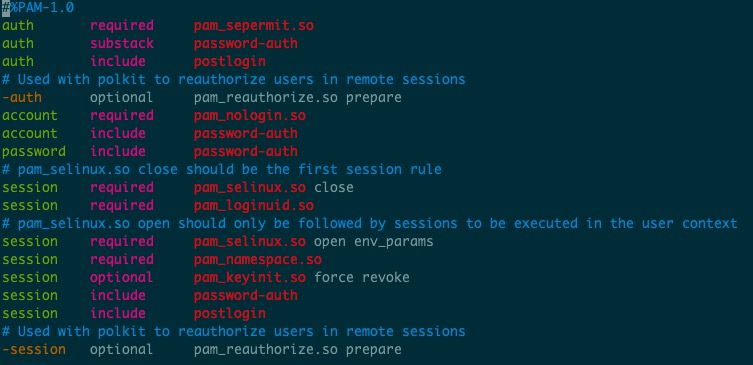

# Linux PAM模块


### 概念

Linux-PAM（Pluggable Authentication Modules for Linux）是一套共享库,使本地系统管理员可以随意选择程序的认证方式。换句话说，不用(重新编写)重新编译一个包含PAM功能的应用程序，就可以改变它使用的认证机制，这种方式下，就算升级本地认证机制,也不用修改程序。

***

### 工作机制


当应用程序希望与PAM交互以处理事件时，他们必须包括libpam，该libpam允许通过库提供的API进行通信。 当PAM看到必须处理的新事件时，它将查看/etc/pam.d中的相关配置文件，并确定在某些阶段必须使用哪些模块。

***

### /etc/pam.d配置文件介绍

配置文件语法

```
type  control  module-path  module-arguments
```

配置文件分为四列

* 第一列代表模块类型
* 第二列代表控制标记
* 第三列代表模块路径
* 第四列代表模块参数


#### 类型

*类型* 是规则对应的管理组。它用于指定后续模块要与哪个管理组关联。

目前有四种类型:

- account

  此模块类型执行基于非身份验证的帐户管理。 通常用于限制/允许对服务的访问，例如是否允许登录,是否达到最大用户数,或是root用户是否允许在这个终端登录等。

- auth

  此模块为用户验证提供两方面服务。让应用程序提示用户输入密码或者其他标记，确认用户合法性；通过他的凭证许可权限，设定组成员关系或者其他优先权。

- password

  此模块用于控制用户更改密码的全过程。

- session

  此模块处理为用户提供服务之前/后需要做的些事情。包括：开启/关闭交换数据的信息，监视目录等，设置用户会话环境等。也就是说这是在系统正式进行服务提供之前的最后一道关口。

如果在类型前加一个短横线 `-`，就表示如果找不到这个模块，导致无法被加载时，这一事件不会被记录在日志中。这个功能适用于那些认证时非必需的、安装时可能没被安装进系统的模块。

#### 控制标记

**流程栈（stack）**

它是认证时执行步骤和规则的堆叠。在某个服务的配置文件中，它体现在了配置文件中的自上而下的执行顺序中。栈是可以被引用的，即在一个栈（或者流程）中嵌入另一个栈。

*控制标记* 规定如何处理PAM模块鉴别认证的结果，简而言之就是鉴别认证成功或者失败之后会发生什么事，如何进行控制。一般有两种形式，一种是比较常见的“关键字”方式，另一种则是用方括号（`[]`）包含的“`value =action`”方式。

###### 关键字方式:

- required

  如果本条目没有被满足，那最终本次认证一定失败，但认证过程不因此打断。整个栈运行完毕之后才会返回“认证失败”信号。

- requisite

  如果本条目没有被满足，那本次认证一定失败，而且整个栈立即中止并返回错误信号。

- sufficient

- 如果本条目的条件被满足，且本条目之前没有任何`required`条目失败，则立即返回“认证成功”信号；如果对本条目的验证失败，不对结果造成影响。

- optional

  该条目仅在整个栈中只有这一个条目时才有决定性作用，否则无论该条验证成功与否都和最终结果无关。

- include

  将其他配置文件中的流程栈包含在当前的位置，就好像将其他配置文件中的内容复制粘贴到这里一样。

- substack

  运行其他配置文件中的流程，并将整个运行结果作为该行的结果进行输出。该模式和 `include` 的不同点在于认证结果的作用域：如果某个流程栈 `include` 了一个带 `requisite` 的栈，这个 `requisite` 失败将直接导致认证失败，同时退出栈；而某个流程栈 `substack` 了同样的栈时，`requisite` 的失败只会导致这个子栈返回失败信号，母栈并不会在此退出。

  

###### value = action方式:

另外还有一种比较复杂的格式为value = action的语法来设置控制标志，标志之间会以空格分开。格式如下：

```javascript
[value1 = action1 value2 = action2 ……]
```

其中value可以是下列Linux PAM库的返回值： 

```markdown
success、open_err、symbol_err、service_err、 system_err、buf_err、perm_denied、auth_err、cred_insufficient、authinfo_unavail、user_unknown、maxtries、new_authtok_reqd、acct_expired、 session_err、cred_unavail、cred_expired、cred_err、no_module_data、conv_err、 authtok_err、authtok_recover_err、authtok_lock_busy、authtok_disable_aging、 try_again、ignore、abort、authtok_expired、module_unknown、bad_item和default。其中，default代表其他所有没有明确说明的返回值。
```

流程栈中很可能有多个验证规则，每条验证的返回值可能不尽相同，那么到底哪一个验证规则能作为最终的结果呢？这就需要 `actionN` 的值来决定了。`actionN` 的值有以下几种：

* ignore

  在一个栈中有多个认证条目的情况下，如果标记 `ignore` 的返回值被命中，那么这条返回值不会对最终的认证结果产生影响。

* bad

  标记 `bad` 的返回值被命中时，最终的认证结果注定会失败。此外，如果这条 `bad` 的返回值是整个栈的第一个失败项，那么整个栈的返回值一定是这个返回值，后面的认证无论结果怎样都改变不了现状了。

* die

  标记 `die` 的返回值被命中时，马上退出栈并宣告失败。整个返回值为这个 `die` 的返回值。

* ok

  在一个栈的运行过程中，如果 `ok` 前面没有返回值，或者前面的返回值为 `PAM_SUCCESS`，那么这个标记了 `ok` 的返回值将覆盖前面的返回值。但如果前面执行过的验证中有最终将导致失败的返回值，那 `ok` 标记的值将不会起作用。

* done

  在前面没有 `bad` 值被命中的情况下，`done` 值被命中之后将马上被返回，并退出整个栈。

* N（无符号整数）

  功效和 `ok` 类似，并且会跳过接下来的 N 个验证步骤。如果 `N = 0` 则和 `ok` 完全相同。

* reset

  清空之前生效的返回值，并且从下面的验证起重新开始。

  

###### 关键字的控制方式也可以用value = action方式来表示

```markdown
#required
[success=ok new_authtok_reqd=ok ignore=ignore default=bad]

#requisite
[success=ok new_authtok_reqd=ok ignore=ignore default=die]

#sufficient
[success=done new_authtok_reqd=done default=ignore]

#optional
[success=ok new_authtok_reqd=ok default=ignore]
```


#### 模块路径

*模块路径* 是应用程序要使用的PAM的绝对路径，或者是默认模块位置的相对路径名，一般为/lib/security /或/lib64/security/，取决于系统架构。

#### 模块参数

*模块参数* 将只和特定模块相关，因此某个模块的文档中一定包含其参数的信息。如果需要在单个参数中使用空格，可以将整个参数用方括号（`[]`）包裹起来。

***

### 一个例子

以/etc/pam.d/sshd为例



加载/etc/pam.d/password-auth配置文件


大部分模块的配置文件可在/etc/security中找到，并进行配置


我们比较常进行配置的最大文件数和最大进程数就是在limit.conf中配置，在sshd中会加载到
