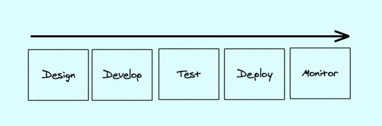
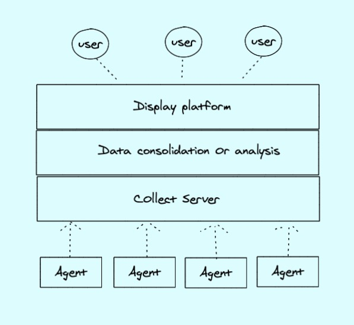

# Oops管理系统(一)

## 系列目录

[《Oops管理系统(一)》](../oops_series_one)

[《Oops管理系统(二)》](../oops_series_two)

***

## 1. 介绍

做了那么的久的运维，了解、运维和开发过各种各样的发布系统、运维系统、监控系统，经历了服务器从物理时代、到云时代再到容器时代的变革，服务器规模也经历从十几台到几千台甚至几万台规模的管理，管理手段也经历从手工到工具再到平台的演变。做过那么些的管理系统，因为各种各样的原因，可能是历史包袱，可能是人言式微，可能是早期技术没有那么的好，很多时候做出来的管理系统不是自己理想中的管理系统，因此，想花一些业余时间，写一个自己理解的DevOps管理系统。

***

## 2. 目标

个人理解，一个DevOps管理系统应该具备以下功能：

* 元数据管理，包括物理资源、云资源、容器资源、中间件资源、应用资源等
* CI/CD，包括应用的打包、编译以及发布，服务器资源的创建、更新、删除等
* 监控告警，能实现不同指标的采集监控，监控数据可视化以及告警自定义等。
* 机器操作，可能是SSH登录，或者远程操作命令等。

***

## 3. 系统设计

完整的一套DevOps系统肯定是功能复杂、组件繁多的，不大可能自己造轮子，因此，底层会采用一些开源方案，然后在各个开源组件上构建自己的管理平台。

### 3.1 元数据管理

说到底，我们要做的是一套能完整接入软件工程生命周期的工具平台，一个软件最终的目的是要发布到线上环境供用户使用，服务器资源只是软件的载体。那么，我们把软件叫做应用，从软件层面上来讲，一个应用应该是唯一的，而从"硬件"层面来说，一台"服务器"也是唯一的。那么，我们就可以将这两个"唯一"建立一种联系，然后再通过这两个唯一延伸出各种关联信息，比如，一个应用可能需要关联它的代码仓库，对应的负责人，归属部门等等，而一台服务器可能需要知道它的机房、机柜，或者是云平台，区域等信息。下图是一个我自己构建的元数据关联图：

在设计元数据的表的时候，我们就可以根据这种关联关系来设计表。

***

### 3.2 CI/CD

一个应用的生命周期一般包含以下步骤：

* **Design**，接收需求，产品设计，沟通等，这边可能需要接入一些项目管理的工具，比如JIRA等、
* **Develop**，程序员进行代码开发、架构设计等
* **Test**，开发人员进行代码测试，测试人员进行功能测试等，这边可以引入一些自动化测试工具。
* **Deploy**，各种人员可能会进行各种环境的部署，这边可以引入类似Jenkins的打包发布工具提高效率。
* **Monitor**，进行监控数据的收集，通过平台输出可视化页面，配置告警、告警通知等功能。

***

### 3.3 监控告警

一个业务应用上线后，需要有工具来知道业务是否出现了问题，这时候就需要提供监控告警的一些工具。一个监控系统一般是如下图所示的架构

* **Agent**，监控数据的收集器，可能是自研的跑在服务器上的采集客户端，也可能是嵌入到应用的收集器等待
* **Server**，接收监控数据，进行存储的服务
* **Data**，对数据进行整合、解析，告警触发、发送告警等操作的服务
* **Display**，展示平台，供用户查看监控数据，配置告警规则的服务

***

### 3.4 机器操作

当整个DevOps平台完善的话，其实用户是可以不需要进入机器进行操作的，但是现实往往是不完美的，因此还需要类似堡垒机这样的服务来供用户登录机器进行一些日志查看，debug等操作。

***

## 4. 初步实现想法

1. 管理页面的话，目前的话想基于[go-admin](https://github.com/go-admin-team/go-admin)来做，一个用vue+go实现的管理系统脚手架
2. 整个元数据的表设计和管理页面设计，目前的话，应该是要自己写，会参考一些例如[bk-cmdb](https://github.com/Tencent/bk-cmdb)、[nightingale](https://github.com/didi/nightingale)等开源方案的设计。
3. CI/CD的话，代码仓库会采用gitlab组件，发布的话可能采用Jenkins、Argo-CD等开源组件，这个之前做的不多，需要再做点调研，载体的话，现在是容器化时代，可能会直接对接k8s来操作。
4. 监控的话，考虑到Kubernetes，直接会在Prometheus+grafana进行二次开发，日志监控选取ELK或者Loki
5. 堡垒机现在还没有进行研究，后续再进行调研。

**基础服务资源**

上面的话，都是针对软件层面的，而应用依赖载体，因此，还需要有一些功能是用来做资源申请的，整体会考虑到兼容物理资源、云服务器资源、容器资源。除了物理资源以为，另外两个其实都可以通过自动化来实现按需创建，即要用的时候再申请。不过，我们还是保留人工审核创建的功能。因此需要做如下事情。

1. 提供工单系统，用于资源的申请和下架，当然，一些事务处理，比如故障处理也可以放在这里做记录
2. 对接物理资源，可能需要录入资源的页面，人工操作，优先需要把字段规范好，高端点，也可以做些自动发现功能。
3. 对接各个云平台，可能采用terrform或者操作云平台API来构建基础设施，包括EC2、RDS、Redis、LB、消息队列、云存储等。
4. 对接k8s集群，包括集群的创建，管理、以及各种k8s资源的操作

***

## 5. 总结

目前的话，暂时就以上这些想法，开发的话，后续会写成一个系列，来深入的说下各个功能的实现。
