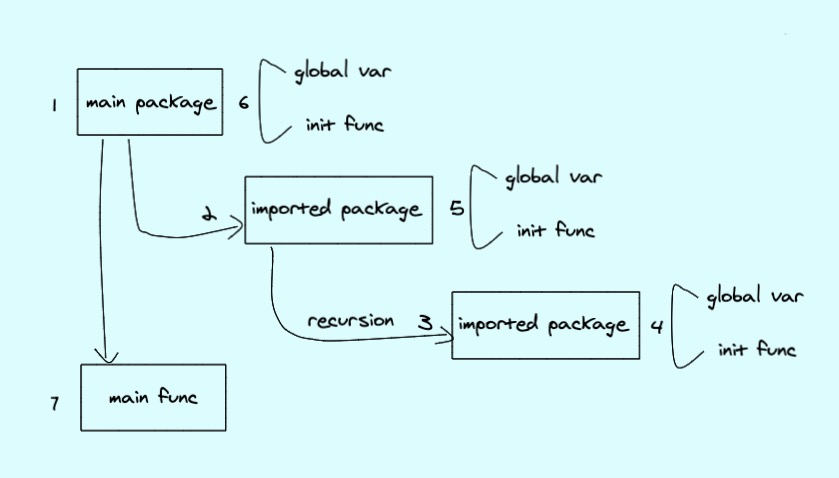

# Oops管理系统(二)


## 系列目录

[《Oops管理系统(一)》](../oops_series_one)

[《Oops管理系统(二)》](../oops_series_two)

***

## 1. 介绍

本篇，要先讲下整体的技术框架。

因为我们是基于go-admin这个脚手架来做前后端框架的，所以，先来说明下整个代码架构。

在这之前，我们先简单说明下go程序的代码执行顺序

### 1.1 Go程序执行顺序



* 执行`go run`或者编译后`binary`文件时，会先加载`main package`
* `main package`一般会`import`其他`package`，其他`package`也会`import`其依赖的`package`，这边会有一个递归的初始化操作。
* `package`会执行`global variables`和`init()`的初始化
* `main package`执行本身的`global variables`和`init()`的初始化
* 执行`main()`

***

## 2. 目录结构

Oops基于[project-layout](https://github.com/golang-standards/project-layout)和[go-admin]()构建了如下图所示的目录结构


***

## 3. 源码解析

这边只说明应用相关的源码逻辑。

### 3.1 系统初始化

**main.go**

```go
package main

import (
	"oops/cmd"
)

func main() {
	cmd.Execute()
}
```

main函数只有一个逻辑，加载cmd包以及执行cmd包中的Execute()函数。

**cmd package**

```go
package cmd

import (
	...
	"oops/internal/common/global"
	"github.com/spf13/cobra"
	"oops/cmd/api"
	...
)

var rootCmd = &cobra.Command{
	...
}

...

func init() {
  ...
	rootCmd.AddCommand(api.StartCmd)
	...
}

//Execute : apply commands
func Execute() {
	if err := rootCmd.Execute(); err != nil {
		os.Exit(-1)
	}
}

```

这边用到了一个cobra的命令行框架，以及加载api的相关逻辑。

**cmd/api**

```go
package api

import (
	...
	"github.com/spf13/cobra"
	"oops/internal/app/admin/router"
	...
)

var (
	configYml string
	StartCmd  = &cobra.Command{
		Use:          "server",
		Short:        "Start API server",
		Example:      "go-admin server -c config/settings.yml",
		SilenceUsage: true,
		PreRun: func(cmd *cobra.Command, args []string) {
			setup()
		},
		RunE: func(cmd *cobra.Command, args []string) error {
			return run()
		},
	}
)

var AppRouters = make([]func(), 0)

func init() {
	...
	//注册路由 fixme 其他应用的路由，在本目录新建文件放在init方法
	AppRouters = append(AppRouters, router.InitRouter)
}

func setup() {

	//1. 读取配置
	...
	//2. 设置日志
	...
	//3. 初始化数据库链接
	...
}

func run() error {
	//运行http服务
  ...
	return nil
}

```

这里进行了注册路由的操作，并读取配置，对日志、数据库以及http server进行初始化。

**internal/app/admin/router**

```go
package router

import (
	...
	"github.com/gin-gonic/gin"
	log "github.com/go-admin-team/go-admin-core/logger"

	"oops/internal/app/admin/middleware"
	"oops/internal/app/admin/middleware/handler"
	common "oops/internal/common/middleware"

	...
)

// InitRouter 路由初始化，不要怀疑，这里用到了
func InitRouter() {
	...
	middleware.InitMiddleware(r)
	// the jwt middleware
	authMiddleware, err := middleware.AuthInit()
	if err != nil {
		log.Fatalf("JWT Init Error, %s", err.Error())
	}

	// 注册系统路由
	InitSysRouter(r, authMiddleware)

	// 注册业务路由
	// TODO: 这里可存放业务路由，里边并无实际路由只有演示代码
	InitExamplesRouter(r, authMiddleware)
}


var (
	routerNoCheckRole = make([]func(*gin.RouterGroup), 0)
	routerCheckRole   = make([]func(v1 *gin.RouterGroup, authMiddleware *jwt.GinJWTMiddleware), 0)
)

// 路由示例
func InitExamplesRouter(r *gin.Engine, authMiddleware *jwt.GinJWTMiddleware) *gin.Engine {

	// 无需认证的路由
	examplesNoCheckRoleRouter(r)
	// 需要认证的路由
	examplesCheckRoleRouter(r, authMiddleware)

	return r
}

// 无需认证的路由示例
func examplesNoCheckRoleRouter(r *gin.Engine) {
	// 可根据业务需求来设置接口版本
	v1 := r.Group("/api/v1")
	// 空接口防止v1定义无使用报错
	v1.GET("/nilcheckrole", nil)

	for _, f := range routerNoCheckRole {
		f(v1)
	}

	// {{无需认证路由自动补充在此处请勿删除}}
	//registerSysFileInfoRouter(v1)
}

// 需要认证的路由示例
func examplesCheckRoleRouter(r *gin.Engine, authMiddleware *jwtauth.GinJWTMiddleware) {
	// 可根据业务需求来设置接口版本
	v1 := r.Group("/api/v1")
	// 空接口防止v1定义无使用报错
	v1.GET("/checkrole", nil)

	for _, f := range routerCheckRole {
		f(v1, authMiddleware)
	}
}

```

这里面实现了具体的路由注册接口逻辑，后续新增的业务路由注册只需要往`routerCheckRole`和`routerNoCheckRole`变量中插入数据即可。

一个例子：

```go

func init() {
	routerCheckRole = append(routerCheckRole, registerApplicationRouter)
}

// 需认证的路由代码
func registerApplicationRouter(v1 *gin.RouterGroup, authMiddleware *jwt.GinJWTMiddleware) {
	api := &cmdb.Application{}
	r := v1.Group("/cmdb/application").Use(authMiddleware.MiddlewareFunc()).Use(middleware2.AuthCheckRole()).Use(actions.PermissionAction())
	{
		r.GET("", api.GetApplicationList)
		r.GET("/:id", api.GetApplication)
		r.POST("", api.InsertApplication)
		r.PUT("", api.UpdateApplication)
		r.DELETE("", api.DeleteApplication)
	}
}
```

该例子将应用相关的路由信息添加到了`routerCheckRole`里面。

***

### 3.2 定义一个业务

**internal/app**

目录结构说明

```
.
├── admin
│   ├── apis
│   │   ├── cmdb
│   │   │   └── application.go
│   ├── middleware
│   ├── models
│   │   ├── cmdb
│   │   │   └── application.go
│   ├── router
│   │   ├── cmdb.go
│   │   ├── router.go
│   └── service
│       ├── cmdb
│       │   ├── application.go
│       │   ├── dto
│       │   │		├── application.go
```

admin：可以理解成一个project

apis.cmdb：是project的api文件

middleware：是project的中间件

models.cmdb：是project的数据库层的模型

router：是project的路由

service.cmdb：是project的业务逻辑处理

service.cmdb.dto：是project的api对应的数据接收以及解析模型

现在，我们按照 models、service.dto、service、apis、router这个顺序来说明；

**models**

```go
package cmdb

import (
	"oops/internal/app/admin/models/system"
	"oops/internal/common/models"
)

type Application struct {
	models.ControlBy
	models.ModelTime
	AppId    int             `gorm:"primaryKey;autoIncrement;comment:应用ID"  json:"appId"`
	AppName  string          `json:"appName" gorm:"type:varchar(64);comment:应用名称"`
	Language string          `json:"language" gorm:"type:varchar(128);comment:语言"`
	Repo     string          `json:"repo" gorm:"type:varchar(128);comment:代码仓库"`
	DeptId   int             `json:"deptId" gorm:"type:bigint(20);comment:部门"`
	UserId   int             `json:"userId" gorm:"type:bigint(20);comment:用户"`
	Remark   string          `json:"remark" gorm:"type:varchar(255);comment:备注"`
	Status   string          `json:"status" gorm:"type:varchar(4);comment:状态"`
	Dept     *system.SysDept `json:"dept"`
	User     *system.SysUser `json:"user"`
}

func (Application) TableName() string {
	return "application"
}

func (e *Application) Generate() models.ActiveRecord {
	o := *e
	return &o
}

func (e *Application) GetId() interface{} {
	return e.AppId
}

```

首先，是一个结构体`Application`里边含有正常的数据库表字段，但是其中又包含了三个结构体：

1、`models.Model` 表id 默认主键是固定的ID和自增长的int类型

2、`models.ControlBy` 表创建人和修改人 数据库表默认必有字段

3、`models.ModelTime` 表创建时间和修改时间、删除时间的字段默认必有字段

**dto**

```go
package dto

import (
	"oops/internal/common/apis"

	"github.com/gin-gonic/gin"

	"oops/internal/app/admin/models/cmdb"
	"oops/internal/common/dto"
	common "oops/internal/common/models"
)
// ApplicationSearch 搜索列表对应的数据接收模型 主要针对分页、列表；
type ApplicationSearch struct {
	dto.Pagination `search:"-"`
	AppId          int    `form:"AppId" search:"type:exact;column:app_id;table:application" comment:"应用ID"`
	AppName        string `form:"appName" search:"type:contains;column:app_name;table:application" comment:"应用名称"`
	Language       string `form:"language" search:"type:contains;column:language;table:application" comment:"语言"`
	Repo           string `form:"repo" search:"type:contains;column:repo;table:application" comment:"仓库地址"`
	DeptId         string `form:"deptId" search:"type:exact;column:dept_id;table:application" comment:"部门"`
	UserId         string `form:"userId" search:"type:exact;column:user_id;table:application" comment:"用户"`
	Status         string `form:"status" search:"type:exact;column:status;table:application" comment:"状态"`
}

// GetNeedSearch 将search 转化为interface
func (m *ApplicationSearch) GetNeedSearch() interface{} {
	return *m
}

// Bind 从上下文中解析数据
func (m *ApplicationSearch) Bind(ctx *gin.Context) error {
	log := apis.GetRequestLogger(ctx)
	err := ctx.ShouldBind(m)
	if err != nil {
		log.Debugf("ShouldBind error: %s", err.Error())
	}
	return err
}
// Generate 将数据转化成数据库使用的结构体
func (m *ApplicationSearch) Generate() dto.Index {
	o := *m
	return &o
}

// ApplicationControl 创建、修改使用的数据接收模型
type ApplicationControl struct {
	AppId    int    `json:"appId" comment:应用ID"`
	AppName  string `json:"appName" comment:应用名称"`
	Language string `json:"language" comment:语言"`
	Repo     string `json:"repo" comment:代码仓库"`
	DeptId   int    `json:"deptId" comment:部门"`
	UserId   int    `json:"userId" comment:用户"`
	Remark   string `json:"remark" comment:备注"`
	Status   string `json:"status" comment:状态"`
}

// Bind 从上下文中解析数据
func (a *ApplicationControl) Bind(ctx *gin.Context) error {
	log := apis.GetRequestLogger(ctx)
	//err := ctx.ShouldBindUri(s)
	//if err != nil {
	//	log.Debugf("ShouldBindUri error: %s", err.Error())
	//	return err
	//}
	err := ctx.ShouldBind(a)
	if err != nil {
		log.Debugf("ShouldBind error: %s", err.Error())
	}
	return err
}

// Generate 将数据转化成数据库使用的结构体
func (a *ApplicationControl) Generate() dto.Control {
	cp := *a
	return &cp
}

func (a *ApplicationControl) GenerateM() (common.ActiveRecord, error) {
	return &cmdb.Application{
		AppId:    a.AppId,
		AppName:  a.AppName,
		Language: a.Language,
		Repo:     a.Repo,
		DeptId:   a.DeptId,
		UserId:   a.UserId,
		Remark:   a.Remark,
		Status:   a.Status,
	}, nil
}

// GetId 获取id
func (s *ApplicationControl) GetId() interface{} {
	return s.AppId
}

// ApplicationById 通过id查询、删除等使用的模型
type ApplicationById struct {
	dto.ObjectById
}

func (s *ApplicationById) Generate() dto.Control {
	cp := *s
	return &cp
}

func (s *ApplicationById) GenerateM() (common.ActiveRecord, error) {
	return &cmdb.Application{}, nil
}
```

**service**

```golang
package cmdb

import (
	"errors"

	"gorm.io/gorm"

	"oops/internal/app/admin/models/cmdb"
	"oops/internal/common/actions"
	cDto "oops/internal/common/dto"
	common "oops/internal/common/models"
	"oops/internal/common/service"
)

type Application struct {
	service.Service
}

// GetApplicationPage 获取Application列表
func (e *Application) GetApplicationPage(c cDto.Index, p *actions.DataPermission, list *[]cmdb.Application, count *int64) error {
	var err error
	var data cmdb.Application

	err = e.Orm.Model(&data).
		Scopes(
			cDto.MakeCondition(c.GetNeedSearch()),
			cDto.Paginate(c.GetPageSize(), c.GetPageIndex()),
			actions.Permission(data.TableName(), p),
		).
		//Preload("Dept").
		Find(list).Limit(-1).Offset(-1).
		Count(count).Error
	if err != nil {
		e.Log.Errorf("db error: %s", err)
		return err
	}
	return nil
}

// GetApplication 获取Application对象
func (e *Application) GetApplication(d cDto.Control, p *actions.DataPermission, model *cmdb.Application) error {
	var err error
	var data cmdb.Application

	db := e.Orm.Model(&data).
		Scopes(
			actions.Permission(data.TableName(), p),
		).
		First(model, d.GetId())
	err = db.Error
	if err != nil && errors.Is(err, gorm.ErrRecordNotFound) {
		err = errors.New("查看对象不存在或无权查看")
		e.Log.Errorf("db error: %s", err)
		return err
	}
	if db.Error != nil {
		e.Log.Errorf("db error: %s", err)
		return err
	}
	return nil
}

// InsertApplication 创建Application对象
func (e *Application) InsertApplication(model common.ActiveRecord) error {
	var err error
	var data cmdb.Application

	err = e.Orm.Model(&data).
		Create(model).Error
	if err != nil {
		e.Log.Errorf("db error: %s", err)
		return err
	}
	return nil
}

// UpdateApplication 修改Application对象
func (e *Application) UpdateApplication(c common.ActiveRecord, p *actions.DataPermission) error {
	var err error

	db := e.Orm.Model(c).
		Scopes(
			actions.Permission(c.TableName(), p),
		).Where(c.GetId()).Updates(c)
	if db.Error != nil {
		e.Log.Errorf("db error: %s", err)
		return err
	}
	if db.RowsAffected == 0 {
		return errors.New("无权更新该数据")

	}
	return nil
}

// RemoveApplication 删除Application
func (e *Application) RemoveApplication(d cDto.Control, c common.ActiveRecord, p *actions.DataPermission) error {
	var err error
	var data cmdb.Application

	db := e.Orm.Model(&data).
		Scopes(
			actions.Permission(data.TableName(), p),
		).Where(d.GetId()).Delete(c)
	if db.Error != nil {
		err = db.Error
		e.Log.Errorf("Delete error: %s", err)
		return err
	}
	if db.RowsAffected == 0 {
		err = errors.New("无权删除该数据")
		return err
	}
	return nil
}
```

service中包含了对数据的一个数据操作

**apis**

```go
package cmdb

import (
	"net/http"

	"github.com/gin-gonic/gin"
	"github.com/go-admin-team/go-admin-core/sdk/pkg/jwtauth/user"

	"oops/internal/app/admin/models/cmdb"
	service "oops/internal/app/admin/service/cmdb"
	"oops/internal/app/admin/service/cmdb/dto"
	"oops/internal/common/actions"
	"oops/internal/common/apis"
	common "oops/internal/common/models"
)

type Application struct {
	apis.Api
}

// @Summary 列表应用信息数据
// @Description 获取JSON
// @Tags 应用
// @Param appName query string false "appName"
// @Success 200 {string} string "{"code": 200, "data": [...]}"
// @Success 200 {string} string "{"code": -1, "message": "抱歉未找到相关信息"}"
// @Router /api/v1/cmdb/application [get]
// @Security Bearer
func (e *Application) GetApplicationList(c *gin.Context) {
	log := e.GetLogger(c)
	d := new(dto.ApplicationSearch)
	db, err := e.GetOrm(c)
	if err != nil {
		log.Error(err)
		return
	}

	req := d.Generate()

	//查询列表
	err = req.Bind(c)
	if err != nil {
		log.Warnf("Bind error: %s", err.Error())
		e.Error(c, http.StatusUnprocessableEntity, err, "参数验证失败")
		return
	}

	//数据权限检查
	p := actions.GetPermissionFromContext(c)

	list := make([]cmdb.Application, 0)
	var count int64
	serviceStudent := service.Application{}
	serviceStudent.Log = log
	serviceStudent.Orm = db
	err = serviceStudent.GetApplicationPage(req, p, &list, &count)
	if err != nil {
		e.Error(c, http.StatusInternalServerError, err, "查询失败")
		return
	}

	e.PageOK(c, list, int(count), req.GetPageIndex(), req.GetPageSize(), "查询成功")
}

// @Summary 获取应用
// @Description 获取JSON
// @Tags 应用
// @Param appId path int true "应用编码"
// @Success 200 {object} app.Response "{"code": 200, "data": [...]}"
// @Router /api/v1/cmdb/application/{appId} [get]
// @Security Bearer
func (e *Application) GetApplication(c *gin.Context) {
	log := e.GetLogger(c)
	control := new(dto.ApplicationById)
	db, err := e.GetOrm(c)
	if err != nil {
		log.Error(err)
		return
	}

	//查看详情
	req := control.Generate()
	err = req.Bind(c)
	if err != nil {
		e.Error(c, http.StatusUnprocessableEntity, err, "参数验证失败")
		return
	}
	var object cmdb.Application

	//数据权限检查
	p := actions.GetPermissionFromContext(c)

	serviceApplication := service.Application{}
	serviceApplication.Log = log
	serviceApplication.Orm = db
	err = serviceApplication.GetApplication(req, p, &object)
	if err != nil {
		e.Error(c, http.StatusUnprocessableEntity, err, "查询失败")
		return
	}

	e.OK(c, object, "查看成功")
}

// @Summary 创建应用
// @Description 获取JSON
// @Tags 应用
// @Accept  application/json
// @Product application/json
// @Param data body models.SysUser true "应用数据"
// @Success 200 {string} string	"{"code": 200, "message": "添加成功"}"
// @Success 200 {string} string	"{"code": -1, "message": "添加失败"}"
// @Router /api/v1/cmdb/application [post]
func (e *Application) InsertApplication(c *gin.Context) {
	log := e.GetLogger(c)
	control := new(dto.ApplicationControl)
	db, err := e.GetOrm(c)
	if err != nil {
		log.Error(err)
		return
	}

	//新增操作
	req := control.Generate()
	err = req.Bind(c)
	if err != nil {
		e.Error(c, http.StatusUnprocessableEntity, err, "参数验证失败")
		return
	}
	var object common.ActiveRecord
	object, err = req.GenerateM()
	if err != nil {
		e.Error(c, http.StatusInternalServerError, err, "模型生成失败")
		return
	}
	// 设置创建人
	object.SetCreateBy(user.GetUserId(c))

	serviceApplication := service.Application{}
	serviceApplication.Orm = db
	serviceApplication.Log = log
	err = serviceApplication.InsertApplication(object)
	if err != nil {
		log.Error(err)
		e.Error(c, http.StatusInternalServerError, err, "创建失败")
		return
	}

	e.OK(c, object.GetId(), "创建成功")
}

// @Summary 修改应用数据
// @Description 获取JSON
// @Tags 应用
// @Accept  application/json
// @Product application/json
// @Param data body models.SysUser true "body"
// @Success 200 {string} string	"{"code": 200, "message": "修改成功"}"
// @Success 200 {string} string	"{"code": -1, "message": "修改失败"}"
// @Router /api/v1/cmdb/application/{appId} [put]
func (e *Application) UpdateApplication(c *gin.Context) {
	control := new(dto.ApplicationControl)

	log := e.GetLogger(c)
	db, err := e.GetOrm(c)
	if err != nil {
		log.Error(err)
		return
	}

	req := control.Generate()
	//更新操作
	err = req.Bind(c)
	if err != nil {
		e.Error(c, http.StatusUnprocessableEntity, err, "参数验证失败")
		return
	}
	var object common.ActiveRecord
	object, err = req.GenerateM()
	if err != nil {
		e.Error(c, http.StatusInternalServerError, err, "模型生成失败")
		return
	}
	object.SetUpdateBy(user.GetUserId(c))

	//数据权限检查
	p := actions.GetPermissionFromContext(c)

	serviceApplication := service.Application{}
	serviceApplication.Orm = db
	serviceApplication.Log = log
	err = serviceApplication.UpdateApplication(object, p)
	if err != nil {
		log.Error(err)
		return
	}
	e.OK(c, object.GetId(), "更新成功")
}

// @Summary 删除应用数据
// @Description 删除数据
// @Tags 应用
// @Param appId path int true "appId"
// @Success 200 {string} string	"{"code": 200, "message": "删除成功"}"
// @Success 200 {string} string	"{"code": -1, "message": "删除失败"}"
// @Router /api/v1/cmdb/application/{appId} [delete]
func (e *Application) DeleteApplication(c *gin.Context) {
	log := e.GetLogger(c)
	control := new(dto.ApplicationById)

	db, err := e.GetOrm(c)
	if err != nil {
		log.Error(err)
		return
	}

	//删除操作
	req := control.Generate()
	err = req.Bind(c)
	if err != nil {
		log.Errorf("Bind error: %s", err)
		e.Error(c, http.StatusUnprocessableEntity, err, "参数验证失败")
		return
	}
	var object common.ActiveRecord
	object, err = req.GenerateM()
	if err != nil {
		e.Error(c, http.StatusInternalServerError, err, "模型生成失败")
		return
	}

	// 设置编辑人
	object.SetUpdateBy(user.GetUserId(c))

	// 数据权限检查
	p := actions.GetPermissionFromContext(c)

	serviceApplication := service.Application{}
	serviceApplication.Orm = db
	serviceApplication.Log = log
	err = serviceApplication.RemoveApplication(req, object, p)
	if err != nil {
		log.Error(err)
		return
	}
	e.OK(c, object.GetId(), "删除成功")
}

```

**routes**

```go
package router

import (
	"oops/internal/app/admin/apis/cmdb"
	"oops/internal/common/actions"
	middleware2 "oops/internal/common/middleware"

	"github.com/gin-gonic/gin"
	jwt "github.com/go-admin-team/go-admin-core/sdk/pkg/jwtauth"
)

func init() {
	routerCheckRole = append(routerCheckRole, registerApplicationRouter)
}

// 需认证的路由代码
func registerApplicationRouter(v1 *gin.RouterGroup, authMiddleware *jwt.GinJWTMiddleware) {
	api := &cmdb.Application{}
	r := v1.Group("/cmdb/application").Use(authMiddleware.MiddlewareFunc()).Use(middleware2.AuthCheckRole()).Use(actions.PermissionAction())
	{
		r.GET("", api.GetApplicationList)
		r.GET("/:id", api.GetApplication)
		r.POST("", api.InsertApplication)
		r.PUT("", api.UpdateApplication)
		r.DELETE("", api.DeleteApplication)
	}
}
```

创建一个空的go文件，设置init初始化接口方法，根据业务定义好路由注册函数名称，并且正确配置正确的权限控制中间件，一套业务就结束了;

***

## 4. 总结

本章说明了oops项目的后端代码结构，以及实现一个业务的逻辑操作。整个项目会用到的主流框架如下：

* go-admin
* cobra
* gorm
* gin
* casbin
* swagger
* viper(后续考虑加入)

***


